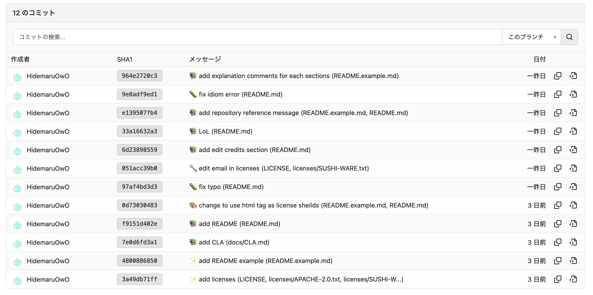

<div align="center">


</div>

# pummit 🚛

Make the commit message more beautiful in CLI 🎨

<details>
  <summary>See commit messages by pummit</summary>
  
</details>

## 🚀 Features

- Beautiful commit message
- Emoji alias
- Lazygit support (option)

## 🛠 Installation

```bash
go install github.com/HidemaruOwO/pummit@latest
```

- macOS or linuxbrew user

```bash
brew tap hidemaruowo/tap
brew update
brew install pummit
```

- others

You can download pummit from builded binary.

```bash
# ~/Downloads

tar xzvf pummit**.tar.gz
sudo mv pummit /usr/local/bin
```

https://github.com/HidemaruOwO/pummit/releases

### 🏗 Build from Source

```bash
git clone https://github.com/HidemaruOwO/pummit.git
cd pummit
go build -ldflags="-s -w" -trimpath main.go

mv main pummit
```

<!-- - Arch Linux -->

<!-- ```sh -->
<!-- git clone https://github.com/HidemaruOwO/MicroRepository.git -->
<!-- cd MicroRepository -->

<!-- makepkg -si -->
<!-- ``` -->

## 🎯 Usage

You can use pummit in two different ways.

```bash
pummit <emojiprefix> '<subject>'
# or
pummit '<emojiprefix> <subject>'

# Example
pummit sparkles 'I am unko man'
# Run: git commit -m ':sparkles: I am unko man (path/to/added/file, path/to/added/file)'

pummit 'sparkles I am unko man'
# Run: git commit -m ':sparkles: I am unko man (path/to/added/file, path/to/added/file)'
```

<details>
    <summary>Learn emoji prefixes</summary>

    # ==================== Emojis ====================
    # 🎉  :tada: 初めてのコミット（Initial Commit）
    # ♻️   :recycle: マージ(Merge)
    # 🔖  :bookmark: バージョンタグ（Version Tag）
    # ✨  :sparkles: 新機能（New Feature）
    # 🐛  :bug: バグ修正（Bagfix）
    # 👀  :eyes: リファクタリング(Refactoring)
    # 📚  :books: ドキュメント（Documentation）
    # 🎨  :art: デザインUI/UX(Accessibility)
    # 🐎  :horse: パフォーマンス（Performance）
    # 🔧  :wrench: ツール（Tooling）
    # 🚨  :rotating_light: テスト（Tests）
    # 💩  :hankey: 非推奨追加（Deprecation）
    # 🗑️  :wastebasket: 削除（Removal）
    # 🚧  :construction: WIP(Work In Progress)
    # ☃️  :snowman: 仕様変更

    # ==================== Format ====================
    # :emoji: Subject (Dir/AddedFile Dir/AddedFile)
    #
    # Commit body...

</details>

## Dependencies 🪡

To use pummit, please register the following command in your path

- git

## To use with lazygit 🔍

If you want to use pummit with lazygit, you should add the following key bindings to `.config/lazygit/config.yml`.

```yaml
customCommands:
  - key: "c"
    prompts:
      - type: "input"
        title: "Commit message"
        initialValue: ""
    command: "pummit '{{index .PromptResponses 0}}'"
    context: "files"
    description: "commit changes(Custom Command)"
```

## 🌍 For contributer

By contributing to this project, you agree to the following terms:

1. **You grant a license**: You grant the project owner a perpetual, worldwide, non-exclusive, royalty-free, irrevocable license to use, modify, distribute, and sublicense your contributions under the **Apache License 2.0**.
2. **You retain ownership**: You still own the copyright of your contribution, but you waive any claims against the project related to your contribution.
3. **No additional patent rights**: You **do not** grant additional patent rights beyond what is covered by Apache 2.0.
4. **Your contributions are original**: You confirm that your contributions do not violate any third-party rights.

By submitting a pull request, you agree to these terms.

## 📜 License

<div align="left" style="flex: inline" >
<a href="https://www.apache.org/licenses/LICENSE-2.0" >

<a href="https://github.com/MakeNowJust/sushi-ware" >

</div>

This project is dual-licensed under [Apache License 2.0](https://www.apache.org/licenses/LICENSE-2.0) and [SUSHI-WARE LICENSE](https://github.com/MakeNowJust/sushi-ware).

A reference to the latest license should be used, even if the attached license is outdated of major versions.

## 🤝 Reference

This repository was created using the [MicroRepository](https://github.com/HidemaruOwO/MicroRepository) template.

- [HidemaruOwO/MicroRepository](https://github.com/HidemaruOwO/MicroRepository)
- [Qiita - Add emojis to GitHub commit messages to improve development efficiency](https://qiita.com/Jung0/items/0a9a7a97a2c17f92d3c5)
