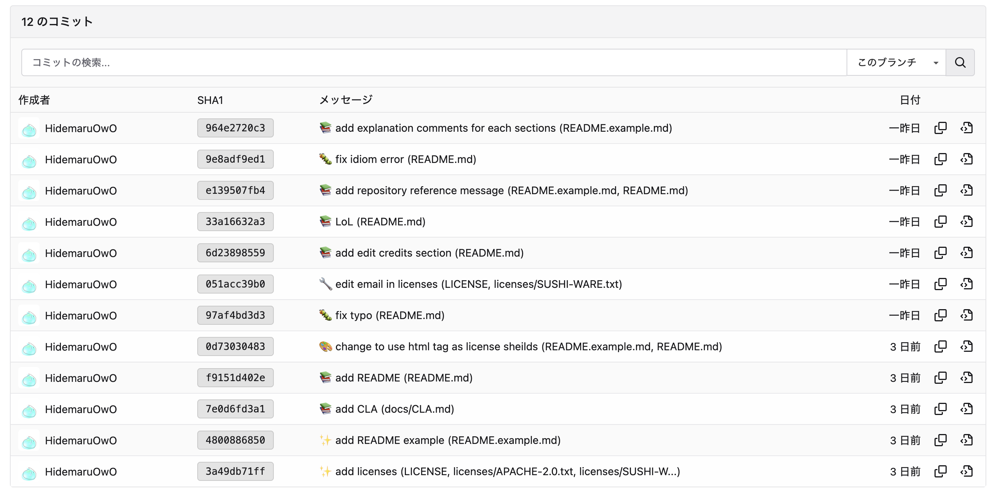

<div align="center">


# pummit 🚛

**Professional Git Commit Message CLI Tool**

Make your commit messages beautiful, consistent, and meaningful with emoji support and smart automation.

[](https://golang.org/doc/go1.20)
[](LICENSE)
[](https://github.com/HidemaruOwO/pummit/releases)
[](https://goreportcard.com/report/github.com/HidemaruOwO/pummit)

[English](README.md)

</div>

---

## ✨ Features

### 🎨 **Beautiful Commit Messages**
- Emoji-prefixed commit messages for visual clarity
- Consistent formatting across your entire project
- Support for Conventional Commits and Gitmoji standards

### 🚀 **Smart Automation**
- **Branch-based suggestions**: Automatically suggests emojis based on branch names (`feature/` → ✨, `fix/` → 🐛)
- **Interactive mode**: Step-by-step guided commit creation with `pummit interactive`
- **Scope support**: Conventional Commits scope input assistance
- **Template system**: Predefined commit message templates

### ⚙️ **Powerful Configuration**
- Flexible alias system with multiple shortcuts
- TOML-based configuration for better readability
- CLI-based configuration management (no editor required)
- Automatic migration from JSON to TOML

### 🌍 **Multi-language Support**
- English and Japanese UI
- Configurable language settings
- Community translation support

### 🛡️ **Enterprise Ready**
- Offline mode for air-gapped environments
- Comprehensive error handling and diagnostics
- Cross-platform compatibility (Windows, macOS, Linux)
- Security-focused design with SBOM generation

<details>
  <summary>📸 See commit messages created by pummit</summary>
  
</details>

---

## 🚀 Quick Start

### Installation

#### Option 1: Go Install (Recommended)
```bash
go install github.com/HidemaruOwO/pummit@latest
```

#### Option 2: Homebrew (macOS/Linux)
```bash
brew tap hidemaruowo/tap
brew update
brew install pummit
```

#### Option 3: Direct Download
Download the latest binary from [Releases](https://github.com/HidemaruOwO/pummit/releases):

```bash
# Download and extract
tar xzvf pummit_*.tar.gz
sudo mv pummit /usr/local/bin/pummit
```

#### Option 4: Build from Source
```bash
git clone https://github.com/HidemaruOwO/pummit.git
cd pummit
go build -o pummit .
```

### Basic Usage

```bash
# Simple commit with emoji alias
pummit sparkles "Add user authentication feature"
# Output: ✨ Add user authentication feature (src/auth.go, tests/auth_test.go)

# Interactive mode for guided commit creation
pummit interactive

# Branch-based auto-suggestion
git checkout feature/user-profile
pummit "Add user profile page"
# Auto-suggests: ✨ sparkles (new feature)
```

---

## 📖 Documentation

### Core Commands

#### Basic Commit
```bash
# Using emoji alias
pummit sparkles "Add new feature"
pummit bug "Fix authentication issue"

# Using emoji directly
pummit ✨ "Add new feature"

# With scope (Conventional Commits)
pummit sparkles "Add login page" --scope auth
```

#### Interactive Mode
```bash
# Launch interactive commit creation
pummit interactive

# Start with specific mode
pummit interactive --mode emoji     # Start with emoji selection
pummit interactive --mode template  # Start with template selection
pummit interactive --mode scope     # Start with scope input
```

#### Configuration Management
```bash
# Open configuration in default editor
pummit config

# Get/set configuration values
pummit config --get base.emoji
pummit config --set base.emoji=true
pummit config --set locale.language=ja

# List all configuration
pummit config --list

# Reset configuration
pummit config --reset
pummit config --reset base  # Reset specific section

# Backup and restore
pummit config --backup ~/my-pummit-config.toml
pummit config --restore ~/my-pummit-config.toml
```

#### Migration & Diagnostics
```bash
# Migrate from JSON to TOML configuration
pummit migrate
pummit migrate --dry-run  # Preview changes only

# System diagnostics
pummit doctor

# Offline mode (no network access required)
pummit --offline sparkles "Add feature"
```

### Built-in Emoji Aliases

| Alias | Emoji | Description | Use Case |
|-------|-------|-------------|----------|
| `s`, `feat`, `feature` | ✨ | sparkles | New features |
| `b`, `fix`, `error` | 🐛 | bug | Bug fixes |
| `d`, `doc`, `docs` | 📚 | books | Documentation |
| `a`, `ui`, `design` | 🎨 | art | UI/UX improvements |
| `c`, `wip` | 🚧 | construction | Work in progress |
| `t`, `new`, `init` | 🎉 | tada | Initial commit |
| `r`, `pr`, `merge` | ♻️ | recycle | Refactoring |
| `l`, `test` | 🚨 | rotating_light | Testing |
| `w`, `tool`, `config` | 🔧 | wrench | Configuration |
| `h`, `perf` | 🐎 | horse | Performance |

### Configuration Structure

Pummit uses TOML configuration for better readability:

```toml
[meta]
version = "3.0.0"

[base]
emoji = true
filesLength = 50  # 0 = disabled, -1 = unlimited

[interactive]
enabled = true
defaultMode = "emoji"  # "emoji", "template", "scope", "branch"
showPreview = true
fuzzySearch = true

[locale]
language = "en"  # "en", "ja"
autoDetect = true

[templates]
enabled = true
defaultTemplate = "default"

[scope]
enabled = true
autoDetect = true
suggestions = ["api", "ui", "core", "auth", "db"]

[branchMapping]
enabled = true
fallback = "construction"

[[branchMapping.rules]]
pattern = "^feature/.*"
emoji = "sparkles"
description = "New feature branch"

[[branchMapping.rules]]
pattern = "^(fix|bugfix|hotfix)/.*"
emoji = "bug"
description = "Bug fix branch"
```

---

## 🛠️ Advanced Usage

### Template System

Create custom commit message templates:

```toml
[templates.definitions.feat]
format = "{emoji} {scope}: {message}\n\n{description}\n\n({files})"
description = "Feature development template"
defaultEmoji = "sparkles"
scope = true
requireDescription = true

[templates.definitions.fix]
format = "{emoji} {scope}: {message}\n\nFixes: {issue}\n\n({files})"
description = "Bug fix template"
defaultEmoji = "bug"
scope = true
fields = ["issue"]
```

### Branch Mapping

Automatic emoji suggestion based on branch names:

```toml
[[branchMapping.rules]]
pattern = "^feature/.*"
emoji = "sparkles"
description = "New feature branch"

[[branchMapping.rules]]
pattern = "^docs/.*"
emoji = "books"
description = "Documentation branch"

[[branchMapping.rules]]
pattern = "^refactor/.*"
emoji = "eyes"
description = "Refactoring branch"
```

### Integration with Git Hooks

Set up pre-commit hooks for automatic pummit usage:

```bash
# .git/hooks/prepare-commit-msg
#!/bin/sh
# Auto-launch pummit for interactive commits
if [ -z "$2" ]; then
    exec pummit interactive
fi
```

---

## 🌍 Platform Support

### Supported Operating Systems

| OS | Version | Terminal | Status |
|----|---------|----------|--------|
| **macOS** | 10.15+ | Terminal.app, iTerm2 | ✅ Fully Supported |
| **Linux** | Ubuntu 20.04+, RHEL 8+ | gnome-terminal, xterm | ✅ Fully Supported |
| **Windows** | Windows 10+ | PowerShell, CMD, Windows Terminal | ✅ Supported |

### Terminal Compatibility

| Terminal | macOS | Linux | Windows | Notes |
|----------|-------|-------|---------|-------|
| Terminal.app | ✅ | - | - | Native support |
| iTerm2 | ✅ | - | - | Full feature support |
| gnome-terminal | - | ✅ | - | Full feature support |
| xterm | - | ✅ | - | Basic support |
| PowerShell | - | - | ✅ | Windows 10+ |
| Windows Terminal | - | - | ✅ | Recommended |
| CMD | - | - | ⚠️ | Limited color support |

---

## 🔧 Development

### Requirements

- Go 1.20 or later
- Git 2.20 or later

### Build from Source

```bash
git clone https://github.com/HidemaruOwO/pummit.git
cd pummit
go build -o pummit .
```

### Running Tests

```bash
# Run all tests
go test ./...

# Run tests with race detection
go test -race ./...

# Run benchmarks
go test -bench=. ./...

# Generate coverage report
go test -coverprofile=coverage.out ./...
go tool cover -html=coverage.out
```

### Project Structure

```
pummit/
├── main.go                    # Application entry point
├── internal/                  # Private application code
│   ├── cli/                  # CLI commands
│   ├── config/               # Configuration management
│   ├── git/                  # Git operations
│   ├── alias/                # Alias management
│   ├── interactive/          # Interactive mode
│   └── telemetry/           # Observability (opt-in)
├── pkg/                      # Public packages
│   ├── gitmoji/             # Gitmoji API integration
│   └── logger/              # Logging utilities
├── docs/                     # Documentation
│   ├── architecture.md      # Architecture specification
│   └── assets/              # Images and assets
└── tests/                    # Test files
    ├── unit/                # Unit tests
    ├── integration/         # Integration tests
    └── e2e/                 # End-to-end tests
```

---

## 🐛 Troubleshooting

### Common Issues

#### Installation Problems
```bash
# Check Go version
go version

# Verify GOPATH/GOBIN
echo $GOPATH
echo $GOBIN

# Re-install with verbose output
go install -v github.com/HidemaruOwO/pummit@latest
```

#### Configuration Issues
```bash
# Run diagnostics
pummit doctor

# Check configuration status
pummit config --status

# Reset to default configuration
pummit config --reset
```

#### Git Integration Problems
```bash
# Verify Git installation
git --version

# Check repository status
git status

# Validate pummit in repository
cd /path/to/your/repo
pummit doctor
```

### Getting Help

- 📖 **Documentation**: Check our [docs](docs/) directory
- 🐛 **Bug Reports**: Open an issue on [GitHub Issues](https://github.com/HidemaruOwO/pummit/issues)
- 💬 **Questions**: Start a discussion on [GitHub Discussions](https://github.com/HidemaruOwO/pummit/discussions)

---

## 🌍 For contributer

By contributing to this project, you agree to the following terms:

1. **You grant a license**: You grant the project owner a perpetual, worldwide, non-exclusive, royalty-free, irrevocable license to use, modify, distribute, and sublicense your contributions under the **Apache License 2.0**.
2. **You retain ownership**: You still own the copyright of your contribution, but you waive any claims against the project related to your contribution.
3. **No additional patent rights**: You **do not** grant additional patent rights beyond what is covered by Apache 2.0.
4. **Your contributions are original**: You confirm that your contributions do not violate any third-party rights.

By submitting a pull request, you agree to these terms.

### Development Workflow

1. Fork the repository
2. Create a feature branch (`git checkout -b feature/amazing-feature`)
3. Make your changes
4. Add tests for your changes
5. Ensure all tests pass (`go test ./...`)
6. Commit your changes using pummit (`pummit sparkles "Add amazing feature"`)
7. Push to the branch (`git push origin feature/amazing-feature`)
8. Open a Pull Request

## 📜 License

<div align="left" style="flex: inline" >
<a href="https://www.apache.org/licenses/LICENSE-2.0" >

<a href="https://github.com/MakeNowJust/sushi-ware" >


---

## 🙏 Acknowledgments

- [Gitmoji](https://gitmoji.dev/) for emoji standardization
- [Conventional Commits](https://www.conventionalcommits.org/) for commit message conventions
- [Cobra](https://github.com/spf13/cobra) for CLI framework
- [Bubble Tea](https://github.com/charmbracelet/bubbletea) for TUI framework
- All [contributors](https://github.com/HidemaruOwO/pummit/contributors) who helped make pummit better

---

<div align="center">

**Made with ❤️ by [HidemaruOwO](https://github.com/HidemaruOwO)**

If pummit helps improve your Git workflow, please ⭐ this repository!

</div>
