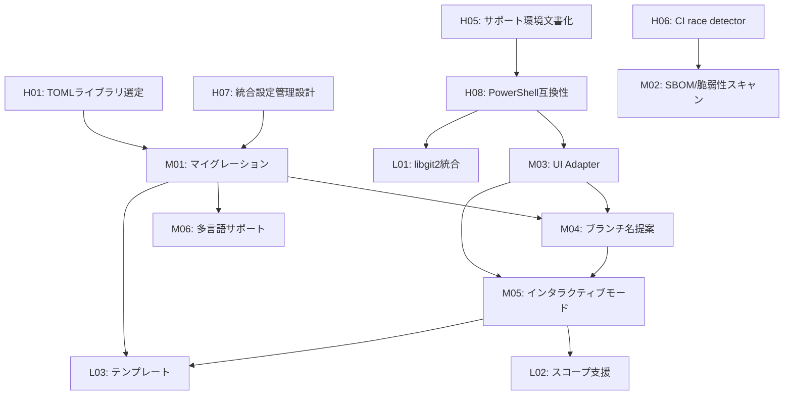

# Pummit プロジェクト TODO

<!-- JSON-LD メタデータ -->

## 📊 進捗サマリー（アーキテクチャ見直し後）

| 優先度 | 完了 | 総数 | 進捗率 | 状態 |
|--------|------|------|--------|------|
| 🔥 High | 2 | 8 | 25% |  |
| 🔷 Medium | 0 | 6 | 0% |  |
| 🔵 Low | 0 | 4 | 0% |  |
| 📋 Maintenance | 0 | 6 | 0% |  |

**全体進捗**: 2/24 (8%)

### ✅ 実装完了済み（優先度から削除 - 総数に含まず）
- ~~H03: `pummit doctor` MVP実装~~ → ✅ 包括的診断機能実装済み
- ~~H04: `--offline`フラグ実装~~ → ✅ 完全なオフライン対応実装済み
- ~~M01: 設定ファイルマイグレーション機能~~ → ✅ JSON→TOML変換実装済み

### 🆕 新たに追加された最優先タスク
- **CLI統一**: v3.0.0でのサブコマンド形式完全移行
- **テスト基盤**: 80%カバレッジ目標での包括的テスト実装

---

## 🔥 High Priority Tasks (短期目標: 1-2週間)

### H01: TOMLライブラリ選定とドキュメント作成 `#foundation` `#performance` `#config`
- [ ] **概要**: BurntSushi/toml vs pelletier/go-tomlの選定とドキュメント化
- **詳細**: 
  - パフォーマンス比較ベンチマーク実施
  - 機能比較表の作成
  - 起動時間への影響測定
  - 選定理由の文書化
- **成功基準**: 
  - ✅ ベンチマーク結果のドキュメント化
  - ✅ 選定理由の明文化
  - ✅ 実装方針の決定
- **推定工数**: 1-2日
- **依存関係**: なし
- **技術要件**: Go benchmarking, TOML libraries
- **関連ファイル**: [`internal/config/toml.go`](internal/config/toml.go)

### H02: 起動時間ベンチマークのCI自動化 `#performance` `#ci` `#monitoring`
- [ ] **概要**: CI/CDでの起動時間計測とパフォーマンス回帰検出
- **詳細**:
  - レッド/イエロー/グリーンの閾値設定（基本動作100ms以下）
  - CI Artifactsでの結果可視化
  - パフォーマンス回帰の自動検出
  - ベンチマーク結果の履歴管理
- **成功基準**:
  - ✅ CIでのベンチマーク自動実行
  - ✅ 100ms超過時のアラート
  - ✅ 継続的なパフォーマンス追跡
- **推定工数**: 2-3日
- **依存関係**: なし
- **技術要件**: GitHub Actions, Go benchmarking
- **関連ファイル**: `.github/workflows/`, benchmark tests

### H03: コマンド体系統一実装 `#feature` `#cli` `#breaking-change`
- [ ] **概要**: v3.0.0でのサブコマンド形式への完全移行実装
- **詳細**:
  - `alias:add` → `alias add` 形式への変更
  - `pummit config` 統合エントリーポイント実装
  - 後方互換性なしの破壊的変更
  - Cobraサブコマンド構造の再設計
- **成功基準**:
  - ✅ 全コマンドのサブコマンド形式対応
  - ✅ `pummit config` 統合機能実装
  - ✅ 古いコロン形式の完全削除
- **推定工数**: 3-4日
- **依存関係**: なし
- **技術要件**: Cobra framework, CLI design
- **関連ファイル**: [`internal/cli/`](internal/cli/) 全体の再構成

### H04: テストスイート基盤構築 `#testing` `#quality` `#foundation`
- [ ] **概要**: 80%カバレッジ目標での包括的テスト実装
- **詳細**:
  - Go test フレームワークの導入
  - コアモジュール（git, config, alias）の基本テスト
  - CI/CDでのテスト自動化
  - テストカバレッジ測定とレポート
- **成功基準**:
  - ✅ 80%以上のテストカバレッジ達成
  - ✅ CI/CDでの自動テスト実行
  - ✅ リファクタリング安全性の確保
- **推定工数**: 5-7日
- **依存関係**: H03 (CLI統一後のテスト実装)
- **技術要件**: Go testing, GitHub Actions, coverage tools
- **関連ファイル**: 各モジュールの `*_test.go` ファイル

### H05: サポートOS/ターミナル表の文書化 `#docs` `#compatibility` `#support`
- [ ] **概要**: READMEにサポート環境の明確化
- **詳細**:
  - サポートOS一覧（Windows, macOS, Linux）
  - サポートターミナル一覧（PowerShell, Bash, Zsh等）
  - 既知の制限事項と回避策
  - Windows PowerShell互換性の明文化
- **成功基準**:
  - ✅ サポート環境表の完成
  - ✅ 制限事項の明文化
  - ✅ ユーザーガイダンスの充実
- **推定工数**: 1日
- **依存関係**: なし
- **技術要件**: documentation
- **関連ファイル**: [`README.md`](README.md)

### H06: CI でのrace detector追加 `#testing` `#quality` `#concurrency`
- [x] **概要**: `go test ./... -race`をCIに統合
- **詳細**:
  - GitHub Actionsでのrace detector実行
  - 並行処理バグの早期検出
  - テスト品質の向上
  - CI失敗時の詳細ログ出力
- **成功基準**:
  - ✅ CIでのrace detector自動実行
  - ✅ 並行処理バグの検出
  - ✅ テスト品質の向上確認
- **推定工数**: 1日
- **依存関係**: なし
- **技術要件**: GitHub Actions, Go race detector
- **関連ファイル**: `.github/workflows/test.yml`

### H07: 統合設定管理コマンド設計 `#feature` `#config` `#ux`
- [x] **概要**: `pummit config`単一エントリーポイントの設計
- **詳細**:
  - 複数サブコマンドの統合設計
  - デフォルト動作（エディター起動）の決定
  - UX複雑化回避のためのシンプル設計
  - パワーユーザー向けオプション整理
- **成功基準**:
  - ✅ 統合設計の完成
  - ✅ UXシンプル化の確認
  - ✅ 実装方針の決定
- **推定工数**: 2-3日
- **依存関係**: なし
- **技術要件**: CLI design, UX planning
- **関連ファイル**: [`internal/cli/config.go`](internal/cli/config.go)

### H08: Windows PowerShell互換性対応 `#compatibility` `#windows` `#terminal`
- [ ] **概要**: Windows PowerShellでの動作保証と問題解決
- **詳細**:
  - PowerShell固有の問題調査
  - pty互換性の確認
  - `--no-interactive`フラグでのフォールバック
  - Windows用テスト環境構築
- **成功基準**:
  - ✅ PowerShellでの基本動作確認
  - ✅ 既知問題の文書化
  - ✅ フォールバック機能の実装
- **推定工数**: 3-4日
- **依存関係**: H05 (サポート環境文書化)
- **技術要件**: Windows testing, PowerShell compatibility
- **関連ファイル**: Windows-specific implementations

---

## 🔷 Medium Priority Tasks (中期目標: 1-3ヶ月)

### M01: AI統合機能の拡張 `#feature` `#ai` `#mcp`
- [ ] **概要**: 既存MCPサーバー機能の発展と新機能追加
- **詳細**:
  - ブランチ名からの自動絵文字提案機能
  - より高度なスマートコミット機能
  - 自然言語でのより複雑なGit操作対応
  - MCPツールの追加実装
- **成功基準**:
  - ✅ ブランチ名解析による絵文字提案
  - ✅ 複雑なGitワークフローの自動化
  - ✅ LLMとの連携強化
- **推定工数**: 4-6日
- **依存関係**: H03 (CLI統一), H04 (テスト基盤)
- **技術要件**: MCP protocol, AI integration
- **関連ファイル**: [`internal/mcp/`](internal/mcp/) モジュール拡張

### M02: SBOM/脆弱性スキャン導入 `#security` `#compliance` `#automation`
- [ ] **概要**: セキュリティ監査の自動化とSBOM生成
- **詳細**:
  - syftによるSBOM（cyclonedx形式）生成
  - govulncheckによる脆弱性スキャン
  - CI Artifacts retention policy（60日以内・内部限定）
  - セキュリティ通知システム
- **成功基準**:
  - ✅ SBOM自動生成
  - ✅ 脆弱性スキャン自動実行
  - ✅ セキュリティゲートの設定
- **推定工数**: 3-4日
- **依存関係**: H06 (CI改善)
- **技術要件**: syft, govulncheck, CI/CD security
- **関連ファイル**: `.github/workflows/security.yml`

### M03: UI Adapterパターン導入 `#architecture` `#ui` `#abstraction`
- [ ] **概要**: Bubble Tea実装を内包するRenderer抽象化
- **詳細**:
  - UIレンダラーインターフェースの設計
  - Bubble Tea実装の抽象化
  - 将来的なUI切り替え対応
  - テスト容易性の向上
- **成功基準**:
  - ✅ Rendererインターフェースの完成
  - ✅ Bubble Tea実装の抽象化
  - ✅ UI切り替え機構の確立
- **推定工数**: 4-6日
- **依存関係**: H08 (PowerShell互換性)
- **技術要件**: interface design, UI abstraction
- **関連ファイル**: [`internal/ui/`](internal/ui/), renderer interface

### M04: ブランチ名自動プレフィックス提案 `#feature` `#git` `#automation`
- [ ] **概要**: ブランチ名から適切な絵文字プレフィックスを自動推測
- **詳細**:
  - feature/, fix/, docs/等のパターン認識
  - 複数候補がある場合のインタラクティブ選択
  - 設定可能なマッピングルール
  - ブランチ名解析エンジン
- **成功基準**:
  - ✅ `feature/user-auth` → `✨ sparkles`の自動提案
  - ✅ 複数候補時の選択UI表示
  - ✅ カスタムマッピングルールの設定可能
- **推定工数**: 4-6日
- **依存関係**: M01 (TOML設定), M03 (UI Adapter)
- **技術要件**: regex patterns, interactive UI
- **関連ファイル**: [`internal/branch/analyzer.go`](internal/branch/analyzer.go), [`internal/branch/mapping.go`](internal/branch/mapping.go)

### M05: インタラクティブモード `#feature` `#ui` `#interactive`
- [ ] **概要**: `pummit interactive`による統合的なコミット作成UI
- **詳細**:
  - ファジーファインダー搭載絵文字選択
  - ステップ式UI（モード選択→絵文字→メッセージ）
  - リアルタイムプレビュー機能
  - キーボードショートカット対応
- **成功基準**:
  - ✅ 快適なファジー検索操作
  - ✅ 直感的なステップ式UI
  - ✅ リアルタイムプレビュー表示
- **推定工数**: 7-10日
- **依存関係**: M03 (UI Adapter), M04 (ブランチ名提案)
- **技術要件**: Bubble Tea, fuzzy search, terminal UI
- **関連ファイル**: [`internal/interactive/`](internal/interactive/), [`internal/interactive/modes/`](internal/interactive/modes/)

### M06: 多言語サポート基盤 `#feature` `#i18n` `#localization`
- [ ] **概要**: 日本語・英語の2言語対応とi18n基盤構築
- **詳細**:
  - システム言語からの自動検出
  - 設定ファイルでの言語切り替え
  - 既存機能の出力メッセージ翻訳
  - 翻訳ファイルの管理システム
- **成功基準**:
  - ✅ `locale.language = "ja"`での日本語表示
  - ✅ 自動言語検出の動作確認
  - ✅ 主要メッセージの翻訳完了
- **推定工数**: 6-8日
- **依存関係**: M01 (TOML設定)
- **技術要件**: locale detection, translation files
- **関連ファイル**: [`internal/locale/`](internal/locale/), [`internal/i18n.go`](internal/i18n.go)

---

## 🔵 Low Priority Tasks (長期目標)

### L01: libgit2統合 `#enhancement` `#performance` `#git`
- [ ] **概要**: libgit2バインディングによるGit操作高速化
- **詳細**:
  - git2goライブラリの統合
  - Windows DLL配布方法の検証
  - 段階的移行戦略
  - パフォーマンス比較検証
- **推定工数**: 8-12日
- **依存関係**: H08 (クロスプラットフォーム)
- **技術要件**: libgit2, CGO, cross-compilation
- **関連ファイル**: Git operation abstractions

### L02: スコープ入力支援 `#feature` `#conventional-commits` `#automation`
- [ ] **概要**: Conventional Commits形式のスコープ自動提案
- **詳細**:
  - 変更ファイルパスからのスコープ推測
  - 過去のコミット履歴からの学習
  - インクリメンタル検索対応
  - カスタムスコープ定義
- **推定工数**: 5-7日
- **依存関係**: M05 (インタラクティブモード)
- **技術要件**: path analysis, git log parsing
- **関連ファイル**: [`internal/scope/`](internal/scope/)

### L03: テンプレート機能 `#feature` `#templates` `#customization`
- [ ] **概要**: プロジェクト別コミットメッセージテンプレート
- **詳細**:
  - デフォルトテンプレートの提供
  - カスタムテンプレートの作成・管理
  - テンプレート変数システム（{emoji}, {scope}, {message}）
  - テンプレート継承機能
- **推定工数**: 6-8日
- **依存関係**: M01 (TOML設定), M05 (インタラクティブモード)
- **技術要件**: template engine, variable substitution
- **関連ファイル**: [`internal/templates/`](internal/templates/)

### L04: 自動更新機能 `#feature` `#update` `#distribution`
- [ ] **概要**: `pummit update`による自動更新システム
- **詳細**:
  - GitHub Releasesとの連携
  - セキュリティパッチ通知
  - バージョン比較・ダウンロード
  - Homebrew/Scoopとの連携
- **推定工数**: 6-8日
- **依存関係**: セキュリティ基盤
- **技術要件**: GitHub API, binary verification
- **関連ファイル**: [`internal/updater/`](internal/updater/)

---

## 📋 Maintenance Tasks

### MT01: セキュリティ監査強化 `#security` `#audit` `#compliance`
- [ ] **概要**: 継続的セキュリティ監査とコンプライアンス
- **詳細**:
  - 依存関係の定期更新
  - ライセンス互換性確認
  - 脆弱性対応プロセス
  - セキュリティベストプラクティス
- **推定工数**: 継続的（月2日程度）
- **技術要件**: security scanning tools, compliance frameworks

### MT02: テストスイート拡充 `#testing` `#quality` `#automation`
- [ ] **概要**: 包括的テスト戦略の実装
- **詳細**:
  - 単体テスト80%カバレッジ達成
  - 統合テスト・E2Eテストの自動化
  - パフォーマンステストスイート
  - マイグレーションテスト
- **推定工数**: 8-10日
- **技術要件**: Go testing, test automation frameworks

### MT03: CI/CD パイプライン強化 `#devops` `#automation` `#quality`
- [ ] **概要**: 品質ゲートとリリース自動化
- **詳細**:
  - 品質ゲート設定（カバレッジ、起動時間等）
  - Dependabot設定
  - 自動リリース機能
  - クロスプラットフォームビルド
- **推定工数**: 4-5日
- **技術要件**: GitHub Actions, quality gates

### MT04: ドキュメント整備 `#docs` `#user-experience` `#api`
- [ ] **概要**: 包括的ドキュメントとAPIリファレンス
- **詳細**:
  - ユーザーガイドの充実
  - 開発者向けAPIドキュメント
  - 多言語ドキュメント
  - インタラクティブチュートリアル
- **推定工数**: 6-8日
- **技術要件**: documentation tools, API doc generation

### MT05: パフォーマンス最適化 `#performance` `#memory` `#optimization`
- [ ] **概要**: メモリ使用量と実行速度の継続的最適化
- **詳細**:
  - メモリプールの活用
  - ガベージコレクション最適化
  - バイナリサイズ削減
  - ネットワーク処理最適化
- **推定工数**: 5-7日
- **技術要件**: profiling tools, optimization techniques

### MT06: 依存関係管理 `#dependencies` `#security` `#maintenance`
- [ ] **概要**: 依存関係の定期更新と脆弱性対応
- **詳細**:
  - 週次依存関係チェック
  - ライセンス互換性確認
  - 代替ライブラリの評価
  - 最小依存原則の維持
- **推定工数**: 継続的（月2日程度）
- **技術要件**: dependency scanning tools

---

## 🎯 マイルストーン管理

### マイルストーン 1: 緊急改善 (v3.1.0) - 2025年7月
**目標**: 基盤技術の確立と即座のリスク軽減
- H01: TOMLライブラリ選定
- H02: 起動時間ベンチマーク自動化
- H03: `pummit doctor` MVP
- H04: `--offline`フラグ実装
- H05: サポート環境文書化
- H06: CI race detector追加
- H07: 統合設定管理設計
- H08: PowerShell互換性対応

### マイルストーン 2: 堅牢性向上 (v3.2.0) - 2025年9月
**目標**: アーキテクチャ改善とセキュリティ強化
- M01: 設定ファイルマイグレーション
- M02: SBOM/脆弱性スキャン
- M03: UI Adapterパターン
- M04: ブランチ名自動提案
- MT02: テストスイート拡充
- MT03: CI/CD強化

### マイルストーン 3: ユーザー体験向上 (v3.3.0) - 2025年12月
**目標**: インタラクティブ機能と多言語対応
- M05: インタラクティブモード
- M06: 多言語サポート基盤
- L02: スコープ入力支援
- L03: テンプレート機能
- MT04: ドキュメント整備

### マイルストーン 4: 長期発展 (v4.0.0) - 2026年6月
**目標**: 高度機能とエンタープライズ対応
- L01: libgit2統合
- L04: 自動更新機能
- MT05: パフォーマンス最適化
- 企業向け機能の検討

---

## 🔄 依存関係マップ

---

## 📈 進捗トラッキング

### AIによる自動進捗更新
このTODOファイルは以下の方法でAIが自動的に管理・更新を支援します：

1. **完了チェック**: `- [x]`形式でタスク完了をマーク
2. **進捗計算**: セクション別・全体の完了率を自動計算
3. **依存関係確認**: 前提タスクの完了状況をチェック
4. **優先度調整**: 完了状況に基づく優先度の動的調整
5. **リスク評価**: 遅延・ブロッカーの早期検出

### 更新ルール
- **日次**: 進捗率の更新
- **週次**: 優先度・依存関係の見直し
- **月次**: マイルストーンの調整
- **リリース時**: 完了タスクのアーカイブ

---

## 🏷️ タグシステム

| タグ | 説明 | 対象タスク数 |
|------|------|-------------|
| `#feature` | 新機能開発 | 8 |
| `#config` | 設定関連 | 5 |
| `#compatibility` | 互換性対応 | 4 |
| `#performance` | パフォーマンス | 4 |
| `#ui` | ユーザーインターフェース | 3 |
| `#testing` | テスト関連 | 3 |
| `#security` | セキュリティ | 3 |
| `#i18n` | 国際化対応 | 2 |
| `#docs` | ドキュメント | 2 |
| `#git` | Git操作関連 | 2 |

---

## 📚 参考資料

- **アーキテクチャ仕様**: [`docs/architecture-v3.md`](docs/architecture-v3.md)
- **学習ログ**: [`docs/llm-context.md`](docs/llm-context.md)
- **現在の実装**: [`internal/`](internal/) ディレクトリ
- **設定例**: [`internal/variable/config.json`](internal/variable/config.json)

---

**更新日**: 2025年6月19日
**バージョン**: 1.0.0
**次回レビュー**: 2025年6月26日
**管理者**: Pummit Development Team
**AI最適化**: ✅ 構造化メタデータ対応