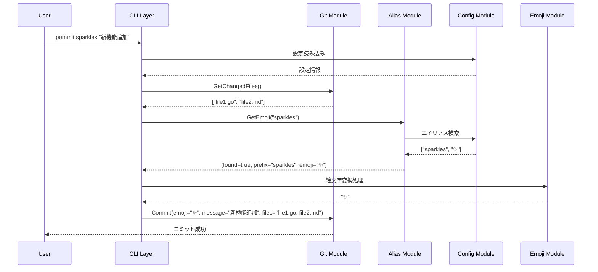
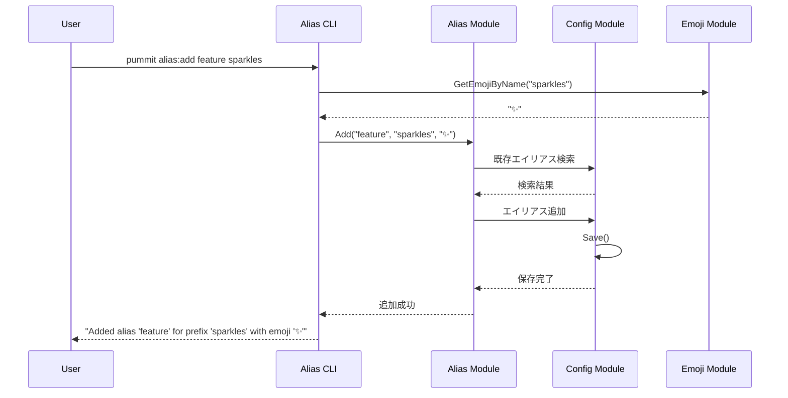

**重要: このドキュメントをLLMが読む際には必ず最初のリーディングは最後の行まで読んでください。**

# Pummit アーキテクチャ仕様書

## 目次

1. [プロジェクト概要](#プロジェクト概要)
2. [現在の実装状況](#現在の実装状況)
3. [システム設計](#システム設計)
4. [モジュール構成](#モジュール構成)
5. [コマンド体系の改善計画](#コマンド体系の改善計画)
6. [設定システム](#設定システム)
7. [AI統合機能（MCP）](#ai統合機能mcp)
8. [技術的負債と対策](#技術的負債と対策)
9. [開発優先度の再評価](#開発優先度の再評価)
10. [品質保証・テスト戦略](#品質保証テスト戦略)
11. [パフォーマンス目標](#パフォーマンス目標)
12. [今後の開発指針](#今後の開発指針)

---

## プロジェクト概要

### 目的

**Pummit**は、Gitコミットメッセージを絵文字付きで美しく作成するためのCLIツールです。AI支援開発環境との統合により、自然言語によるGit操作と一貫性のあるコミットメッセージ作成を支援します。

### 主要機能（v2.0.0実装済み）

- **絵文字付きコミット**: 絵文字プレフィックスによる視覚的なコミットメッセージ
- **エイリアス機能**: 短縮形での絵文字指定（`s,feat,feature` → `✨`）
- **オフライン対応**: `--offline`フラグによるネットワーク非依存動作
- **設定管理**: JSON/TOML形式での柔軟な設定とマイグレーション機能
- **診断機能**: `pummit doctor`による包括的な環境チェック
- **AI統合**: MCPサーバーによるClaude Desktop等との連携
- **インタラクティブUI**: Bubble Teaベースの確認ダイアログとプロンプト

### 技術要件

- **言語**: Go 1.23.0+
- **プラットフォーム**: クロスプラットフォーム対応（Windows, macOS, Linux）
- **依存関係**: 最小限の外部依存（mcp-go, cobra, bubbletea等）
- **パフォーマンス**: 100ms以下の起動時間

---

## 現在の実装状況

### ✅ 実装完了済み機能

#### 1. コア機能
- **基本コミット機能**: `pummit [emoji] [message]`の完全実装
- **オフライン対応**: `--offline`フラグによるGitmoji API非依存動作
- **絵文字システム**: Discord絵文字データとGitmoji API連携の両対応

#### 2. 設定管理システム
- **TOML設定対応**: `internal/config/toml.go`による完全なTOML形式対応
- **自動マイグレーション**: JSON→TOML変換機能（`pummit migrate`）
- **プレビュー機能**: Bubble Teaベースのエディター選択UIによる変換結果確認

#### 3. エイリアス管理
- **完全なCRUD操作**: add/delete/list/reset機能の実装
- **複数エイリアス名対応**: `["s,feat,feature", "sparkles", "✨"]`形式での管理
- **設定ファイル統合**: TOML/JSON両形式での保存・読み込み

#### 4. 診断機能
- **`pummit doctor`**: Git設定、リポジトリ状態、設定ファイル、ネットワーク、権限の包括的チェック
- **システム情報表示**: OS、Go版本、Pummit版本、Git版本の詳細表示
- **問題解決提案**: 検出された問題に対する具体的な修復方法提示

#### 5. AI統合（MCP機能）
- **`pummit mcp`**: JSON-RPC over stdioによるMCPサーバー起動
- **9つのMCPツール**: Git操作（6個）、設定管理、エイリアス管理、診断機能
- **スマートコミット**: `git.smart_commit`による自律的ワークフロー実現
- **LLM誘導設計**: 戦略的な説明文による適切なツール選択機能

### ⚠️ 改善必要な領域

#### 1. コマンド体系
- **現在**: コロン形式（`alias:add`, `alias:delete`等）
- **課題**: 業界標準（サブコマンド形式）との乖離、UXの一貫性不足

#### 2. テストカバレッジ
- **現在**: テストファイルがほとんど存在しない状況
- **課題**: リファクタリングや機能追加時の安全性確保が困難

#### 3. 設定システムの複雑性
- **現在**: JSON/TOML両対応による分岐処理が存在
- **課題**: 保守性の悪化とバグ混入リスク

---

## システム設計

### 全体アーキテクチャ

```mermaid
graph TD
    subgraph User Interface Layer
        A[CLI Commands]
        B[Interactive Prompts]
        C[MCP Server (pummit mcp)]
    end

    subgraph Application Layer
        D[Root Command Handler]
        E[Alias Commands]
        F[MCP Command Handler]
    end

    subgraph Business Logic Layer
        G[Git Ops]
        H[Alias Mgmt]
        I[Config Mgmt]
        J[Doctor]
    end

    subgraph Infrastructure Layer
        K[File System]
        L[Network]
        M[Logging]
        N[Stdio JSON-RPC]
    end

    subgraph External Systems
        O[Git Repository]
        P[Gitmoji Service]
        Q[User Config Files]
        R[MCP Client (e.g. Claude Desktop)]
    end

    A & B --> D & E
    C --> F

    D & E --> G & H & I & J
    F --> G & H & I & J

    G & H & I & J --> K & L & M
    F --> N

    K & L & M --> O & P & Q
    N <--> R
```

### レイヤー構成

#### 1. ユーザーインターフェース層

**責務**: ユーザーとの直接的なやり取り
- CLI コマンド解析
- インタラクティブプロンプト
- 出力フォーマッティング

**主要コンポーネント**:
- [`internal/cli/root.go`](internal/cli/root.go:1) - メインコマンド
- [`internal/cli/alias/`](internal/cli/alias/:1) - エイリアス管理コマンド
- [`internal/prompt/prompt.go`](internal/prompt/prompt.go:1) - インタラクティブUI

#### 2. アプリケーション層

**責務**: ビジネスロジックの調整と制御
- コマンド処理の協調
- エラーハンドリング
- ログ管理

#### 3. ビジネスロジック層

**責務**: 核となる業務ロジック
- Git操作の抽象化
- エイリアス管理
- 絵文字変換処理
- 設定管理

#### 4. インフラストラクチャ層

**責務**: 外部システムとの連携
- ファイルシステム操作
- ネットワーク通信
- ログ出力

---

## モジュール構成

### パッケージ構造

```
pummit/
├── main.go                           # エントリーポイント
├── internal/                         # 内部実装（非公開）
│   ├── cli/                         # CLI関連
│   │   ├── root.go
│   │   ├── mcp.go                   # MCPサーバー起動コマンド
│   │   └── ...
│   ├── mcp/                         # MCPサーバー機能
│   │   ├── server.go                # サーバー初期化とツール登録
│   │   ├── tool_git.go              # Git関連ツール
│   │   ├── tool_config.go           # 設定関連ツール
│   │   ├── tool_alias.go            # エイリアス関連ツール
│   │   └── tool_doctor.go           # 診断ツール
│   ├── alias/                       # エイリアス管理ロジック
│   │   └── alias.go
│   ├── config/                      # 設定管理
│   │   └── config.go
│   ├── doctor/                      # 診断機能
│   │   └── checker.go
│   ├── emojis/                      # 絵文字処理
│   │   └── emojis.go
│   ├── git/                         # Git操作
│   │   └── git.go
│   ├── prompt/                      # インタラクティブUI
│   │   └── prompt.go
│   ├── utils/                       # ユーティリティ
│   │   └── slice.go
│   └── variable/                    # 定数・埋め込みデータ
│       ├── consts.go
│       ├── config.json
│       └── discord-emojis.flat.json
├── pkg/                             # 公開パッケージ
│   ├── gitmoji/                     # Gitmoji API連携
│   │   └── gitmoji.go               # API クライアント
│   └── logger/                      # ログ機能
│       └── logger.go                # ロガー実装
└── docs/                            # ドキュメント
    └── ...
```

### 責務分散の現状評価

#### 強み
- **明確なレイヤー分離**: UI/Application/Business/Infrastructure の適切な分離
- **機能別モジュール**: git, alias, config, doctor の独立性が高い
- **MCP統合**: 既存ビジネスロジック層の効果的な再利用による実装効率

#### 改善が必要な箇所
- **CLI構造**: コロン形式からサブコマンド形式への移行
- **テスト構造**: 包括的テストスイートの不足

---

## コマンド体系の改善計画

### 現在のコマンド構造（v2.0.0）

```bash
pummit [emoji] [message...]           # メインコミット機能
pummit alias:add [name] [emoji]       # エイリアス追加
pummit alias:delete [name]            # エイリアス削除
pummit alias:list                     # エイリアス一覧
pummit alias:reset                    # エイリアス初期化
pummit doctor                         # 診断機能
pummit mcp                           # MCPサーバー起動
pummit migrate                       # 設定マイグレーション（v4.0.0で削除予定）
pummit version                       # バージョン表示
pummit --offline                     # オフラインモード
```

### 新しいコマンド体系（v3.0.0で即座に移行）

```bash
# メインコマンド（変更なし）
pummit [emoji] [message...]

# エイリアス管理（サブコマンド化）
pummit alias add [name] [emoji]       # alias:add → alias add
pummit alias delete [name]            # alias:delete → alias delete
pummit alias list                     # alias:list → alias list
pummit alias reset                    # alias:reset → alias reset

# 設定管理（新規統合）
pummit config                         # デフォルト：エディター起動
pummit config get [key]               # 設定値取得
pummit config set [key] [value]       # 設定値変更
pummit config list                    # 全設定一覧
pummit config edit                    # エディター起動（明示的）
pummit config validate               # 設定検証
pummit config reset                   # 設定初期化

# マイグレーション管理（拡張・永続化）
pummit migrate                        # 利用可能なマイグレーション一覧
pummit migrate v1v2json               # v1/v2 JSON設定からTOMLへの変換
pummit migrate gitconfig              # .gitconfig設定のインポート
pummit migrate aliases                # 他ツールのエイリアス設定インポート
pummit migrate backup                 # 設定のバックアップ作成
pummit migrate restore [file]         # 設定の復元

# 管理コマンド（変更なし）
pummit doctor                         # 診断機能
pummit mcp                           # MCPサーバー
pummit version                       # バージョン表示
```

### v3.0.0実装要件

#### 1. 即座に削除される機能（破壊的変更）
- `pummit alias:add` → 削除（`pummit alias add`に置き換え）
- `pummit alias:delete` → 削除（`pummit alias delete`に置き換え）
- `pummit alias:list` → 削除（`pummit alias list`に置き換え）
- `pummit alias:reset` → 削除（`pummit alias reset`に置き換え）

#### 2. 新規実装されるCobraサブコマンド構造
```go
// v3.0.0 CLI構造
rootCmd
├── aliasCmd                          # pummit alias
│   ├── aliasAddCmd                   # pummit alias add
│   ├── aliasDeleteCmd                # pummit alias delete
│   ├── aliasListCmd                  # pummit alias list
│   └── aliasResetCmd                 # pummit alias reset
├── configCmd                         # pummit config
│   ├── configGetCmd                  # pummit config get
│   ├── configSetCmd                  # pummit config set
│   ├── configListCmd                 # pummit config list
│   ├── configEditCmd                 # pummit config edit
│   ├── configValidateCmd             # pummit config validate
│   └── configResetCmd                # pummit config reset
├── migrateCmd                        # pummit migrate
│   ├── migrateListCmd                # pummit migrate (一覧表示)
│   ├── migrateV1V2JsonCmd            # pummit migrate v1v2json
│   ├── migrateGitconfigCmd           # pummit migrate gitconfig
│   ├── migrateAliasesCmd             # pummit migrate aliases
│   ├── migrateBackupCmd              # pummit migrate backup
│   └── migrateRestoreCmd             # pummit migrate restore
├── doctorCmd                         # pummit doctor
├── mcpCmd                           # pummit mcp
└── versionCmd                       # pummit version
```

#### 3. 実装方針
- **クリーンな移行**: 後方互換性は提供せず、v3.0.0で完全に新形式に移行
- **統一されたUX**: 業界標準のサブコマンド形式でユーザー体験を向上
- **保守性の向上**: シンプルな実装によるメンテナンス負荷軽減
- **永続的マイグレーション機能**: 様々な設定移行シナリオに対応

---

## データフロー

### 1. メインコマンド実行フロー



### 2. エイリアス管理フロー



### 3. 設定管理フロー

```
アプリケーション起動時の設定読み込み:
┌─────────────┐
│ アプリ起動  │
└─────────────┘
        │
        ▼
┌─────────────┐
│config.Init()│
└─────────────┘
        │
        ▼
┌───────────────────┐
│ 設定ファイル存在? │◄─── ~/.config/pummit/config.json をチェック
└───────────────────┘
        │
        ▼
    ┌─────┴─────┐
    │           │
   Yes          No
    │           │
    ▼           ▼
┌──────────┐  ┌─────────────────┐
│既存設定  │  │デフォルト設定   │
│読み込み  │  │作成             │
└──────────┘  └─────────────────┘
    │           │
    │           ▼
    │       ┌─────────────┐
    │       │設定ファイル │
    │       │作成         │
    │       └─────────────┘
    │           │
    └─────┬─────┘
          ▼
┌─────────────────┐
│CurrentConfigに │
│設定をロード     │
└─────────────────┘
          │
          ▼
┌─────────────┐
│アプリ実行   │
└─────────────┘

設定変更時の保存フロー:
┌─────────────┐
│設定変更操作 │ ◄─── pummit alias:add, alias:delete など
└─────────────┘
        │
        ▼
┌─────────────┐
│config.Save()│
└─────────────┘
        │
        ▼
┌─────────────────┐
│ファイルシステム │
│に保存           │ ◄─── JSON形式で ~/.config/pummit/config.json に保存
└─────────────────┘

設定ファイルの構造:
~/.config/pummit/
├── config.json          (メイン設定ファイル)
└── (将来の拡張用)

権限とセキュリティ:
- config.json: 0644 (読み取り専用、所有者のみ書き込み可)
- ディレクトリ: 0755 (標準的なアクセス権限)
```

### 4. エラーハンドリングフロー

```
操作実行時のエラー処理パターン:

┌─────────────┐
│  操作実行   │
└─────────────┘
        │
        ▼
    ┌─────────┐
    │エラー   │
    │発生?    │
    └─────────┘
        │
   ┌────┴────┐
   │         │
  No        Yes
   │         │
   ▼         ▼
┌─────────┐ ┌─────────────┐
│正常処理 │ │エラー種別   │
│続行     │ │判定         │
└─────────┘ └─────────────┘
                │
        ┌───────┼───────┬─────────┐
        │       │       │         │
        ▼       ▼       ▼         ▼
┌──────────┐ ┌──────────┐ ┌──────────┐ ┌──────────┐
│ErrAlias  │ │ErrAlias  │ │FileSystem│ │Network   │
│Exists    │ │NotFound  │ │Error     │ │Error     │
└──────────┘ └──────────┘ └──────────┘ └──────────┘
        │       │           │           │
        └───┬───┘           │           │
            │               │           │
            ▼               ▼           ▼
    ┌─────────────┐ ┌─────────────┐ ┌─────────────┐
    │ユーザー     │ │システム     │ │リトライ     │
    │フレンドリー │ │エラーログ   │ │機構         │
    │メッセージ   │ └─────────────┘ └─────────────┘
    └─────────────┘         │           │
            │               │           │
            │               ▼           │
            │       ┌─────────────┐     │
            │       │処理終了     │     │
            │       └─────────────┘     │
            │               │           │
            └───────────────┼───────────┘
                            │
                            ▼
                    ┌─────────────┐
                    │最終処理終了 │
                    └─────────────┘

エラー種別と対応:

[1] ErrAliasExists
    出力: "エイリアス '%s' は既に存在します"
    動作: 処理中断、現在の設定を維持

[2] ErrAliasNotFound
    出力: "エイリアス '%s' が見つかりません"
    動作: 処理中断、何も変更しない

[3] FileSystemError
    出力: "設定ファイルの読み書きに失敗しました: %v"
    動作: 詳細なエラーログを記録、処理中断

[4] NetworkError
    出力: "ネットワーク接続に失敗しました (フォールバック機能を使用)"
    動作: ローカルの絵文字データを使用してリトライ

[5] その他のエラー
    出力: "予期しないエラーが発生しました: %v"
    動作: スタックトレースをログに記録、処理中断
```

---

## 設定システム

### 設定ファイル構造

**場所**: `~/.config/pummit/config.json`

```json
{
  "writeEmoji": true,
  "useAlias": true,
  "useLimitPathesLength": true,
  "limitPathesLength": 50,
  "alias": [
    ["s,feat,feature", "sparkles", "✨"],
    ["c,wip", "construction", "🚧"],
    ["t,new,init", "tada", "🎉"],
    ["r,pr,pull,merge", "recycle", "♻️"],
    ["wb,rm,remove,del,delete", "wastebasket", "🗑️"],
    ["b,fix,error", "bug", "🐛"],
    ["e,lint,format,refactor", "eyes", "👀"],
    ["d,doc,docs,document,documents", "books", "📚"],
    ["a,ui,design,icon,icons", "art", "🎨"],
    ["h,tune,tuning,perform,performance", "horse", "🐎"],
    ["w,change,tool,tools,lib,library", "wrench", "🔧"],
    ["l,test,testing", "rotating_light", "🚨"],
    ["sm,special,important", "snowman", "☃️"],
    ["p,pack,mod,module", "package", "📦️"]
  ]
}
```

### 設定項目詳細

| 項目 | 型 | デフォルト | 説明 |
|------|----|---------:|------|
| `writeEmoji` | `bool` | `true` | 絵文字を直接出力するか（false の場合は `:name:` 形式） |
| `useAlias` | `bool` | `true` | エイリアス機能を使用するか |
| `useLimitPathesLength` | `bool` | `true` | ファイルパス長の制限を使用するか |
| `limitPathesLength` | `int` | `50` | ファイルパス表示の最大文字数 |
| `alias` | `[][]string` | デフォルトエイリアス | エイリアス定義配列 |

### エイリアス配列形式

```go
// 形式1: [エイリアス名(複数可), プレフィックス, 絵文字]
["s,feat,feature", "sparkles", "✨"]

// 形式2: [エイリアス名(複数可), 絵文字のみ]
["custom", "🔥"]
```

### 設定初期化プロセス

1. **起動時**: [`config.Init()`](internal/config/config.go:1008)
2. **ホームディレクトリ取得**: `os.UserHomeDir()`
3. **設定ディレクトリ作成**: `~/.config/pummit/`
4. **デフォルト設定読み込み**: 埋め込み JSON から
5. **既存設定確認**: 設定ファイルの存在チェック
6. **設定マージ**: 既存設定 + デフォルト設定
7. **設定保存**: 最新設定をファイルシステムに保存

---

## 外部依存関係

### Go言語標準ライブラリ

- `encoding/json`: 設定ファイル処理
- `os`: ファイルシステム操作
- `os/exec`: Git コマンド実行
- `path/filepath`: ファイルパス操作
- `net/http`: Gitmoji API 通信

### サードパーティライブラリ

| ライブラリ | バージョン | 用途 | ライセンス |
|-----------|-----------|------|-----------|
| [Cobra](https://github.com/spf13/cobra) | v1.9.1 | CLI フレームワーク | Apache 2.0 |
| [Bubble Tea](https://github.com/charmbracelet/bubbletea) | v1.3.4 | TUI フレームワーク | MIT |
| [Bubbles](https://github.com/charmbracelet/bubbles) | v0.20.0 | TUI コンポーネント | MIT |
| [Lipgloss](https://github.com/charmbracelet/lipgloss) | v1.0.0 | スタイリング | MIT |
| [Color](https://github.com/fatih/color) | v1.18.0 | カラー出力 | MIT |

### 外部サービス

**Gitmoji API**
- **URL**: `https://raw.githubusercontent.com/carloscuesta/gitmoji/master/packages/gitmojis/src/gitmojis.json`
- **用途**: 最新の Gitmoji データ取得
- **フォールバック**: 埋め込み絵文字データ

### 依存関係管理戦略

1. **最小依存原則**: 必要最小限の外部依存
2. **バージョン固定**: セマンティックバージョニング遵守
3. **ライセンス互換性**: Apache 2.0 と互換性のあるライセンスのみ
4. **セキュリティ**: 定期的な脆弱性チェック

---

## MCPサーバー機能

### 1. 概要

pummitにModel Context Protocol (MCP) サーバー機能を追加し、外部のMCPクライアント（例: Claude Desktop）からpummitの機能を利用可能にします。これにより、AIアシスタントとの連携を強化し、自然言語によるGit操作や設定管理を実現します。

### 2. アーキテクチャとプロトコル実装

- **統合方法**: `pummit mcp` コマンドを新しいエントリーポイントとして追加します。このコマンドは標準入出力（stdio）を介してJSON-RPC通信を行い、MCPサーバーとして動作します。
- **プロトコル実装**: `github.com/mark3labs/mcp-go` ライブラリを利用してサーバーを構築します。このライブラリはMCPの高レベルな抽象化を提供し、プロトコルの詳細を意識することなくツールやリソースの定義に集中できます。
- **既存ロジックの再利用**: MCPハンドラは、`internal/git`, `internal/config`, `internal/alias`, `internal/doctor` といった既存のビジネスロジック層のモジュールを再利用し、機能の一貫性を保ちます。

### 3. コマンド体系

```bash
# MCPサーバーを標準入出力モードで起動
pummit mcp
```

### 4. モジュール構成

`internal/mcp/` ディレクトリを新設し、MCPサーバー関連のコードを集約します。

```
internal/
├── mcp/
│   ├── server.go        # MCPサーバーの初期化とツール登録
│   ├── tool_git.go      # Git関連ツールの定義とハンドラ
│   ├── tool_config.go   # 設定関連ツールの定義とハンドラ
│   ├── tool_alias.go    # エイリアス関連ツールの定義とハンドラ
│   └── tool_doctor.go   # 診断ツールの定義とハンドラ
└── cli/
    └── mcp.go           # `pummit mcp` コマンドの定義
```

### 5. ツール定義

LLMが自律的なワークフローを実行できるよう、以下のプリミティブなツールを提供します。

#### `git` ツール

ここの説明を実際に実装するときは英語で書いてください。実際の実装上での`git.smart_commit`と`git.commit`の説明にこの文章をそのまま使ってください。（またこれは重要なことなのでllm-context.mdにメモること）

| ツール名 | 説明 | 入力パラメータ | 出力例（成功時） |
| :--- | :--- | :--- | :--- |
| `git.smart_commit` | **PRIMARY TOOL FOR COMMITTING.** Intelligently analyze repository changes and create a commit with auto-generated message and emoji. Use this when the user simply says 'commit', 'make a commit', or gives minimal instructions like 'commit the changes' without specifying exact files or messages. Handles the complete workflow: file analysis, message generation, and execution. | `message_hint: string` (optional), `auto_approve: bool` (default: false) | `{ "status": "pending_approval", "plan": {...} }` or `{ "success": true }` |
| `git.get_edited_files` | `git status -s -u` を実行し、変更があったファイルの一覧をショートフォーマットで取得します。 | `(none)` | `{ "status": " M internal/git/git.go\n?? new_file.txt" }` |
| `git.get_current_branch` | 現在のGitブランチ名を取得します。 | `(none)` | `{ "branch": "main" }` |
| `git.add_files` | 指定されたファイルをステージングします。 | `files: string[]` | `{ "success": true }` |
| `git.commit` | Create a Git commit with specific user-provided emoji, message, and staging preferences. Use this ONLY when the user provides explicit commit details (specific message, emoji, or file selection). For simple 'commit' requests, use git.smart_commit instead. | `emoji: string`, `message: string`, `offline: bool` | `{ "success": true }` |
| `git.move_branch` | 指定されたブランチにチェックアウトします。 | `branch: string` | `{ "success": true }` |
| `git.create_branch` | 新しいブランチを作成してチェックアウトします。 | `branch: string` | `{ "success": true }` |

#### `alias` ツール

| ツール名 | 説明 | 入力パラメータ | 出力例（成功時） |
| :--- | :--- | :--- | :--- |
| `alias.list_aliases` | すべてのエイリアスの一覧を取得します。 | `(none)` | `{ "aliases": { "feat": "✨", "fix": "🐛" } }` |

#### `doctor` ツール

| ツール名 | 説明 | 入力パラメータ | 出力例（成功時） |
| :--- | :--- | :--- | :--- |
| `doctor.run_diagnostics` | システムの健全性を診断します。 | `(none)` | `{ "results": [...] }` |

### 6. LLMの自律的ワークフロー

このツールセットにより、LLMは「コミットして」という単純な指示から、以下のような自律的ワークフローを実行できます。

1.  **現状把握**: `git.get_edited_files` と `git.get_current_branch` を実行し、「どのファイルが変更され、どのブランチにいるか」を把握します。
2.  **計画立案**: 変更されたファイルの内容を分析し、どのようなコミットが適切かを判断します。同時に `alias.list_aliases` を実行して、利用可能な絵文字エイリアスを確認します。
3.  **実行**:
    -   `git.add_files` を呼び出し、コミット対象のファイルをステージングします。
    -   ファイルの内容とエイリアスに基づき、最適なコミットメッセージ（例: `✨ 新機能を追加`）を生成します。
    -   `git.commit` を呼び出して、生成したメッセージでコミットを実行します。

### 7. エラーハンドリング設計

LLMがエラー発生時に自律的に回復を試みたり、ユーザーに的確な報告をしたりできるよう、エラー情報を構造化し、具体的な対応方針を定めます。(実際にはこれらの出力は英語で)

| ツール | エラーシナリオ | LLMの対応策 | LLMからユーザーへの報告メッセージ例 |
| :--- | :--- | :--- | :--- |
| **`git.get_edited_files`** | Gitリポジトリではない | 処理を中断し、ユーザーに `git init` の実行を提案する。 | 「おっと、ここはGitリポジトリではないようです。コミット機能を使うには、まずリポジトリを初期化する必要があります。`git init` を実行して初期化しますか？」 |
| **`git.add_files`** | 指定ファイルが存在しない | `get_edited_files` を再実行してファイル一覧を再確認し、正しいファイル名で再試行する。失敗が続く場合はユーザーに報告する。 | 「ファイル `non_existent_file.go` が見つかりませんでした。もう一度ファイル名を確認してみますね... やはり見つからないようです。ファイル名が正しいか、またはファイルが削除されていないか確認していただけますか？」 |
| **`git.commit`** | ステージングされたファイルがない | `get_edited_files` を実行し、変更があれば `add_files` を呼び出してから `commit` を再試行する。変更がなければユーザーに報告する。 | 「コミットする変更が見つかりませんでした。ですが、いくつか変更されたファイルがあるようです。これらのファイルをステージングしてコミットしますか？」 |
| | Gitの `user.name`/`user.email` が未設定 | `doctor` ツールを実行して診断し、具体的な設定コマンドをユーザーに提示する。 | 「コミットを実行するために、Gitのユーザー設定が必要です。`doctor` ツールで確認したところ、`user.name` と `user.email` が設定されていないようです。以下のコマンドを実行して設定してください。\n```\ngit config --global user.name \"Your Name\"\ngit config --global user.email \"you@example.com\"\n```」 |
| **`git.move_branch`** | 指定ブランチが存在しない | ユーザーにブランチが存在しないことを報告し、`create_branch` を使って新規作成するかどうかを尋ねる。 | 「ブランチ `feature/new-idea` は存在しないようです。同名の新しいブランチを作成して、そちらに移動しますか？」 |
| **`git.create_branch`** | 指定ブランチが既に存在する | ユーザーにブランチが既に存在することを報告し、`move_branch` を使ってそのブランチに移動するかどうかを尋ねる。 | 「ブランチ `feature/existing-work` は既に存在していますね。そのブランチに移動しますか？」 |

### 8. テスト戦略

- **単体テスト**: 各ツールのハンドラ関数が、正常系・異常系の両方で正しく動作することを検証します。既存のビジネスロジックはモック化します。
- **統合テスト**: `mcp-go`のテスト機能を利用し、サーバー全体がMCPリクエストに対して正しく応答できるかを確認します。実際のstdioを模した入力を用いて、リクエストからレスポンスまでの一連の流れをテストします。

## AI統合機能（MCP）

### 実装完了済みの機能

#### 1. MCPサーバー基盤
- **`pummit mcp`コマンド**: JSON-RPC over stdioによるMCPサーバー起動 ✅
- **9つのMCPツール**: Git操作、設定管理、診断機能を網羅 ✅
- **LLM自律ワークフロー**: 「コミットして」という自然語指示で動作 ✅

#### 2. 核心機能: `git.smart_commit`
- **現状把握**: `git.GetChangedFiles()`, `git.GetStagedFiles()`, `git.GetBranch()` ✅
- **自動分析**: ブランチ名からの絵文字推測、ファイル拡張子からのメッセージ生成 ✅
- **自動実行**: ファイルステージング、コミット実行 ✅
- **LLM誘導**: "PRIMARY TOOL FOR COMMITTING" 説明文で優先選択を促す ✅

#### 3. 技術的実装の特徴
- **既存API活用**: 既存ビジネスロジック層の最大限の再利用 ✅
- **最小限の新規実装**: 迅速な機能提供 ✅
- **レイヤー化アーキテクチャ**: 効果的な活用 ✅
- **LLM誘導設計**: 戦略的な説明文によるツール選択の誘導 ✅

---

## 技術的負債と対策

### 現在の技術的負債

#### 1. テストカバレッジの不足 🔴 高優先度
**現状**: テストファイルがほとんど存在しない
**影響**: リファクタリングや機能追加時の安全性確保が困難
**対策**: 
- 80%カバレッジ目標での段階的テスト実装
- 重要なビジネスロジック（Git操作、設定管理）の優先実装
- CI/CDでのテスト自動化

#### 2. CLI構造の一貫性不足 🟡 中優先度
**現状**: コロン形式（`alias:add`）と通常形式の混在
**影響**: ユーザー体験の一貫性不足、学習コストの増加
**対策**: v3.0.0でのサブコマンド形式への完全移行（実装計画済み）

#### 3. 設定システムの一時的複雑性 🟢 低優先度
**現状**: JSON/TOML両対応による分岐処理
**影響**: 保守性への一時的な影響
**対策**: v4.0.0でのJSON設定削除による自動解決（migrate機能削除と同時）

### 対策の優先順位

#### 即座に対応すべき項目
1. **テストフレームワークの導入**: `go test`基盤の整備
2. **コアモジュールのテスト**: git, config, alias の基本テスト
3. **CI/CDでのテスト自動化**: GitHub Actions での継続的テスト

#### v3.0.0での対応項目
1. **CLI構造の統一**: サブコマンド形式への移行
2. **統合設定管理**: `pummit config`コマンドの実装
3. **ドキュメント更新**: 新コマンド体系の文書化

---

## 開発優先度の再評価

### 実装完了状況を踏まえた優先度調整

#### ✅ 完了済み（優先度削除）
- ~~設定ファイルマイグレーション機能~~ → ✅ 実装済み
- ~~オフライン対応機能~~ → ✅ `--offline`フラグ実装済み
- ~~診断機能（`pummit doctor` MVP）~~ → ✅ 包括的診断機能実装済み
- ~~MCPサーバー機能~~ → ✅ 9つのツール完全実装済み

#### 🔥 新たな最高優先度
1. **コマンド体系統一** - v3.0.0での破壊的変更実装
2. **テストスイート導入** - 安全な開発基盤の確立
3. **統合設定管理** - `pummit config`の完全実装

#### 🔷 中期優先度（機能拡張）
1. **インタラクティブモード** - Bubble Teaベースの統合UI
2. **ブランチ名自動提案** - 既存MCP機能の発展
3. **多言語対応基盤** - i18n基盤構築

#### 🔵 長期優先度（最適化）
1. **パフォーマンス最適化** - 起動時間・メモリ使用量
2. **libgit2統合** - Git操作の高速化
3. **企業向け機能** - チーム設定、統計機能

### 現実的な開発ロードマップ

#### v3.0.0（2025年7月）- 基盤整備
- CLI構造の完全統一
- テストフレームワーク導入
- 統合設定管理実装

#### v3.1.0（2025年9月）- 機能拡張
- インタラクティブモード
- ブランチ名自動提案
- 多言語対応基盤

#### v3.2.0（2025年12月）- 最適化
- パフォーマンス改善
- 追加テスト実装
- ドキュメント充実

#### v4.0.0（2026年3月）- クリーンアップ
- JSON設定削除
- migrate機能削除
- 長期機能の実装

---
---

## マイグレーション機能仕様（永続機能）

### 拡張されたマイグレーション体系

#### 概要
pummitの設定や他ツールからの移行を支援する包括的なマイグレーション機能です。
単なるJSON→TOML変換を超えて、様々な設定移行シナリオに対応します。

#### 実装するマイグレーション機能

##### 1. v1v2json - レガシー設定移行
```bash
pummit migrate v1v2json [--dry-run] [--backup]
```
- **目的**: v1/v2時代のJSON設定からTOML形式への変換
- **対象**: `~/.config/pummit/config.json`
- **機能**:
  - エイリアス配列の正規化
  - 設定項目名の変更対応
  - 自動バックアップ作成

##### 2. backup/restore - 設定バックアップ
```bash
pummit migrate backup [--name backup-name]
pummit migrate restore [backup-file]
```
- **backup機能**:
  - 現在の設定の完全バックアップ
  - タイムスタンプ付きファイル名
  - 設定ファイル + エイリアス情報
- **restore機能**:
  - バックアップファイルからの復元
  - 復元前の現在設定保護
  - 段階的復元オプション

#### コマンド体系
```bash
# マイグレーション一覧と状況確認
pummit migrate                        # 利用可能なマイグレーション一覧
pummit migrate status                 # 各マイグレーションの実行状況

# 具体的なマイグレーション実行
pummit migrate v1v2json               # v1/v2 JSON→v3 TOML変換
pummit migrate backup --name pre-v3   # v3移行前バックアップ
pummit migrate restore backup.toml    # 指定バックアップから復元

# 共通オプション
--dry-run                            # 実行内容のプレビューのみ
--backup                             # 実行前の自動バックアップ
--force                              # 確認なしで実行
--verbose                            # 詳細な実行ログ
```

### JSON → TOML 移行（レガシー機能）

#### 新しいTOML設定構造
```toml
[meta]
version = "3.0"

[base]
emoji = true # writeEmoji から変更
filesLength = 50 # 0 = 無効, -1 = 無制限

[interactive]
enabled = true
defaultMode = "emoji" # "emoji", "template", "scope", "branch"
showPreview = true
fuzzySearch = true

[locale]
language = "ja"  # "en", "ja", "zh", "ko"
autoDetect = true # システム言語から自動検出

[templates]
enabled = true
defaultTemplate = "default"

[templates.definitions.default]
format = "{emoji} {message} ({files})"
description = "標準テンプレート"

[templates.definitions.feat]
format = "{emoji} {scope}: {message}\n\n{description}\n\n({files})"
description = "新機能追加用テンプレート"
defaultEmoji = "sparkles"
scope = true
requireDescription = true

[scope]
enabled = true
autoDetect = true
suggestions = ["api", "ui", "core", "auth", "db"]
fromHistory = true
historyLimit = 50

[alias]
enabled = true

[[alias.entries]]
shortcuts = ["s", "feat", "feature"]
name = "sparkles"
emoji = "✨"

[[alias.entries]]
shortcuts = ["c", "wip"]
name = "construction"
emoji = "🚧"

[[alias.entries]]
shortcuts = ["t", "new", "init"]
name = "tada"
emoji = "🎉"

[[alias.entries]]
shortcuts = ["r", "pr", "pull", "merge"]
name = "recycle"
emoji = "♻️"

[[alias.entries]]
shortcuts = ["wb", "rm", "remove", "del", "delete"]
name = "wastebasket"
emoji = "🗑️"

[[alias.entries]]
shortcuts = ["b", "fix", "error"]
name = "bug"
emoji = "🐛"

[[alias.entries]]
shortcuts = ["e", "lint", "format", "refactor"]
name = "eyes"
emoji = "👀"

[[alias.entries]]
shortcuts = ["d", "doc", "docs", "document", "documents"]
name = "books"
emoji = "📚"

[[alias.entries]]
shortcuts = ["a", "ui", "design", "icon", "icons"]
name = "art"
emoji = "🎨"

[[alias.entries]]
shortcuts = ["h", "tune", "tuning", "perform", "performance"]
name = "horse"
emoji = "🐎"

[[alias.entries]]
shortcuts = ["w", "change", "tool", "tools", "lib", "library"]
name = "wrench"
emoji = "🔧"

[[alias.entries]]
shortcuts = ["l", "test", "testing"]
name = "rotating_light"
emoji = "🚨"

[[alias.entries]]
shortcuts = ["sm", "special", "important"]
name = "snowman"
emoji = "☃️"

[[alias.entries]]
shortcuts = ["p", "pack", "mod", "module"]
name = "package"
emoji = "📦️"

[branchMapping]
enabled = true
fallback = "construction"

[[branchMapping.rules]]
pattern = "^feature/.*"
emoji = "sparkles"
description = "新機能ブランチ"

[[branchMapping.rules]]
pattern = "^(fix|bugfix|hotfix)/.*"
emoji = "bug"
description = "バグ修正ブランチ"

[[branchMapping.rules]]
pattern = "^docs/.*"
emoji = "books"
description = "ドキュメントブランチ"

[[branchMapping.rules]]
pattern = "^refactor/.*"
emoji = "eyes"
description = "リファクタリングブランチ"

[[branchMapping.rules]]
pattern = "^test/.*"
emoji = "rotating_light"
description = "テストブランチ"
```

#### マイグレーション仕様

**ファイル検索優先順位**
1. `~/.config/pummit/config.toml` （最優先）
2. `~/.config/pummit/config.json` （レガシー、自動変換対象）
3. デフォルト設定で新規作成

**マイグレーション処理フロー**
```
起動時設定読み込み:
┌─────────────────┐
│config.toml      │
│存在チェック     │
└─────────────────┘
         │
    ┌────┴────┐
   Yes        No
    │          │
    ▼          ▼
┌─────────┐ ┌─────────────────┐
│TOML     │ │config.json      │
│読み込み │ │存在チェック     │
└─────────┘ └─────────────────┘
              │
         ┌────┴────┐
        Yes        No
         │          │
         ▼          ▼
    ┌─────────┐ ┌─────────────┐
    │JSON→TOML │ │デフォルト   │
    │変換実行  │ │TOML作成     │
    └─────────┘ └─────────────┘
         │          │
         ▼          │
    ┌─────────┐     │
    │JSONファイル    │
    │.bakに保存│     │
    └─────────┘     │
         │          │
         └────┬─────┘
              ▼
    ┌─────────────┐
    │設定ロード   │
    │完了         │
    └─────────────┘
```

**JSON→TOML変換ルール**
```go
// 変換マッピング
type MigrationMapping struct {
    // 基本設定
    "writeEmoji" → "base.emoji"
    "useAlias" → "alias.enabled"
    "useLimitPathesLength" → "base.filesLength" (true/false → 50/0)
    "limitPathesLength" → "base.filesLength"
    
    // エイリアス変換
    "alias": [][]string → "alias.entries": []AliasEntry
    // ["s,feat", "sparkles", "✨"] → {shortcuts=["s","feat"], name="sparkles", emoji="✨"}
}
```

**コマンド仕様**
```bash
# 手動マイグレーション
pummit migrate
pummit migrate --force  # 既存TOMLファイルを上書き
pummit migrate --dry-run  # 変換結果のプレビューのみ

# 設定管理コマンド（統合版）
pummit config                                    # 設定ファイルをエディターで開く（デフォルト動作）
pummit config --get base.emoji                  # 設定値の取得
pummit config --set base.emoji=true             # 設定値の変更
pummit config --list                            # 全設定の一覧表示
pummit config --reset                           # 全設定をデフォルトに戻す
pummit config --reset base                      # 特定セクションのみリセット
pummit config --validate                        # 設定ファイルの整合性確認
pummit config --path                            # 設定ファイル場所表示
pummit config --status                          # 設定ファイル状態確認

# 設定バックアップ・復元（シンプル化）
pummit config --backup PATH                     # 設定のバックアップ
pummit config --restore PATH                    # 設定の復元

# 診断機能（早期MVP実装）
pummit doctor                                    # 設定検証 + Git/Terminal 情報出力
```

#### 実装構造
```
internal/
├── config/
│   ├── config.go        # 設定管理（拡張）
│   ├── toml.go         # TOML形式対応（BurntSushi/toml使用予定）
│   ├── migration.go    # マイグレーション処理
│   ├── validator.go    # 設定バリデーション
│   ├── operations.go   # 設定操作（get/set/list/reset統合）
│   └── backup.go       # バックアップ・復元機能
├── cli/
│   ├── migrate.go      # マイグレーションコマンド
│   ├── config.go       # 統合設定コマンド
│   └── doctor.go       # 診断コマンド（MVP）
└── telemetry/          # 可観測性（opt-in）
    ├── metrics.go      # OpenTelemetry（環境変数制御）
    └── tracing.go      # 起動時間・操作トレース
```

---

## 新機能仕様

### 実装優先順位

1. **設定ファイルマイグレーション機能** （最優先）
2. **ブランチ名からのプレフィックス自動提案**
3. **インタラクティブな絵文字・エイリアス選択機能の強化**
4. **スコープ入力支援**
5. **コミットメッセージテンプレート機能**

### 1. ブランチ名からのプレフィックス自動提案

#### 概要
現在のブランチ名から適切な絵文字プレフィックスを自動推測・提案する機能。

#### 実装仕様

**コマンド動作例**
```bash
# feature/user-authブランチの場合
$ git branch --show-current
feature/user-auth

$ pummit "ユーザー認証機能を追加"
🔍 ブランチ名から推測: feature/user-auth → ✨ sparkles
✨ ユーザー認証機能を追加 (src/auth.go, tests/auth_test.go)

# 複数候補がある場合
$ pummit "認証機能修正"
🔍 ブランチ名から複数の候補が見つかりました:
1. ✨ sparkles (新機能)
2. 🐛 bug (バグ修正)
選択してください [1]:
```

**実装構造**
```
internal/
├── branch/
│   ├── analyzer.go      # ブランチ名解析
│   ├── mapping.go       # マッピングルール
│   └── suggestion.go    # 提案エンジン
└── git/
    └── branch.go        # ブランチ情報取得（拡張）
```

### 2. インタラクティブモード (`pummit interactive`)

#### 概要
ファジーファインダー機能とステップ式UIを組み込んだ包括的なインタラクティブコミット作成機能。

#### コマンド仕様
```bash
# インタラクティブモード起動
pummit interactive

# 特定モードで起動
pummit interactive --mode emoji      # 絵文字選択から開始
pummit interactive --mode template   # テンプレート選択から開始
pummit interactive --mode scope      # スコープ入力から開始
pummit interactive --mode branch     # ブランチ提案から開始
```

#### UI仕様（多言語対応）

**1. モード選択画面**
```
┌─────────────────────────────────────────┐
│ 🎯 Pummit Interactive Mode             │
├─────────────────────────────────────────┤
│ How would you like to create commit?    │
├─────────────────────────────────────────┤
│ > 🔍 Select emoji/alias                 │
│   📝 Choose template                    │
│   🎯 Specify scope                      │
│   ⚡ Auto-suggest from branch          │
├─────────────────────────────────────────┤
│ [↑↓] Select  [Enter] Confirm  [q] Quit │
└─────────────────────────────────────────┘
```

**2. 絵文字選択画面（ファジーファインダー）**
```
┌─────────────────────────────────────────────────────────┐
│ 🔍 Search emoji & alias                                │
├─────────────────────────────────────────────────────────┤
│ > feat                                                  │
├─────────────────────────────────────────────────────────┤
│ ✨ sparkles (s,feat,feature) - New feature             │
│ 🎉 tada (t,new,init) - Initial commit                  │
│ 🐛 bug (b,fix,error) - Bug fix                         │
│ 📚 books (d,doc,docs) - Documentation                  │
│ 🔧 wrench (w,change,tool) - Tool changes               │
│                                                         │
│ [↑↓] Select  [Enter] Confirm  [Esc] Back               │
└─────────────────────────────────────────────────────────┘
```

**3. メッセージ入力画面**
```
┌─────────────────────────────────────────────────────────┐
│ ✨ sparkles selected                                    │
├─────────────────────────────────────────────────────────┤
│ Enter commit message:                                   │
│ > Add user authentication feature                       │
├─────────────────────────────────────────────────────────┤
│ Preview:                                                │
│ ✨ Add user authentication feature (src/auth.go, ...)  │
├─────────────────────────────────────────────────────────┤
│ [Enter] Commit  [Ctrl+C] Cancel  [Tab] Options         │
└─────────────────────────────────────────────────────────┘
```

#### 多言語サポート仕様

**対応言語**
- 🇺🇸 English (en)
- 🇯🇵 日本語 (ja)
- 🇨🇳 中文 (zh)
- 🇰🇷 한국어 (ko)

**言語設定**
```toml
[locale]
language = "ja"  # "en", "ja", "zh", "ko"
autoDetect = true # システム言語から自動検出
```

**翻訳例**
```go
// 英語
"Select emoji/alias" → "絵文字・エイリアス選択"
"Enter commit message" → "コミットメッセージを入力"
"New feature" → "新機能"

// 中国語
"Select emoji/alias" → "选择表情符号/别名"
"Enter commit message" → "输入提交消息"
"New feature" → "新功能"

// 韓国語
"Select emoji/alias" → "이모지/별칭 선택"
"Enter commit message" → "커밋 메시지 입력"
"New feature" → "새로운 기능"
```

#### 実装構造
```
internal/
├── interactive/
│   ├── model.go         # Bubble Tea モデル
│   ├── modes/
│   │   ├── emoji.go     # 絵文字選択モード
│   │   ├── template.go  # テンプレート選択モード
│   │   ├── scope.go     # スコープ入力モード
│   │   └── branch.go    # ブランチ提案モード
│   ├── fuzzy.go         # ファジー検索
│   └── i18n.go          # 国際化対応
├── locale/
│   ├── en.json          # 英語翻訳
│   ├── ja.json          # 日本語翻訳
│   ├── zh.json          # 中国語翻訳
│   └── ko.json          # 韓国語翻訳
└── cli/
    └── interactive.go   # interactiveサブコマンド
```

### 3. スコープ入力支援

#### 概要
Conventional Commits形式のスコープ（例: `feat(api): ...`）の入力を支援する機能。

#### 自動検出機能
```
自動検出ルール:
1. 変更ファイルパスからスコープを推測
   src/api/ → api
   frontend/ → ui
   docs/ → docs

2. 過去のコミット履歴からスコープを抽出
   git log --pretty=format:"%s" | grep -E "(feat|fix)\([^)]+\)"

3. ブランチ名からスコープを推測
   feature/api-auth → api
   fix/ui-button → ui
```

### 4. コミットメッセージテンプレート機能

#### 概要
プロジェクトやコミットの種類に応じて、予め定義されたコミットメッセージのテンプレートを適用できる機能。

#### コマンド仕様
```bash
# テンプレート使用
pummit --template feat "ユーザー認証機能を追加"

# インタラクティブモード
pummit --interactive

# テンプレート一覧表示
pummit template:list

# テンプレート追加
pummit template:add custom "カスタムテンプレート" "{emoji} [{scope}] {message}"
```

---
## 品質保証・テスト戦略

### テスト方針

#### 1. テスト構成
```
tests/
├── unit/                    # 単体テスト
│   ├── config_test.go      # 設定管理
│   ├── alias_test.go       # エイリアス機能
│   ├── git_test.go         # Git操作
│   └── migration_test.go   # マイグレーション
├── integration/            # 統合テスト
│   ├── cli_test.go         # CLIコマンド
│   ├── interactive_test.go # インタラクティブモード
│   └── e2e_test.go         # エンドツーエンド
├── compatibility/          # 互換性テスト
│   ├── terminal_test.go    # ターミナル互換性
│   ├── os_test.go          # OS互換性
│   └── git_versions_test.go # Gitバージョン互換性
└── performance/            # パフォーマンステスト
    ├── startup_test.go     # 起動時間
    └── memory_test.go      # メモリ使用量
```

#### 2. テストカバレッジ目標（現実的数値）
- **単体テスト**: 80% 以上
- **統合テスト**: 主要フローの 80-85% 網羅（入力組み合わせ爆発を避ける）
- **E2Eテスト**: クリティカルパスの 85% 網羅（Fail-Fast文化重視）
- **全体目標**: 80% 以上を維持し、品質と保守性のバランスを重視

#### 3. CI/CD テスト戦略
```yaml
# .github/workflows/test.yml の概要
test:
  strategy:
    matrix:
      os: [ubuntu-latest, windows-latest, macos-latest]
      go: ['1.20', '1.21', '1.22']
  steps:
    - name: Unit Tests
      run: go test ./... -race -coverprofile=coverage.out
    
    - name: Integration Tests
      run: go test ./tests/integration/... -v
    
    - name: Vulnerability Scan
      run: govulncheck ./...
    
    - name: SBOM Generation
      run: syft . -o cyclonedx-json=sbom.json
```

#### 4. 特殊テスト項目

**マイグレーションテスト**
```go
func TestJSONToTOMLMigration(t *testing.T) {
    tests := []struct {
        name     string
        jsonData string
        expected TOMLConfig
        wantErr  bool
    }{
        {
            name: "basic migration",
            jsonData: `{"writeEmoji": true, "useAlias": true}`,
            expected: TOMLConfig{Base: BaseConfig{Emoji: true}},
        },
        {
            name: "complex alias migration",
            jsonData: `{"alias": [["s,feat", "sparkles", "✨"], ["b,bug", "bug", "🐛"]]}`,
            expected: TOMLConfig{/* ... */},
        },
        // エッジケース: エスケープ文字、重複alias
    }
}
```

**ターミナル互換性テスト**
```go
func TestTerminalCompatibility(t *testing.T) {
    terminals := []string{
        "xterm", "xterm-256color", "screen", "tmux", 
        "windows-powershell", "windows-cmd",
    }
    
    for _, term := range terminals {
        t.Run(term, func(t *testing.T) {
            // Bubble Tea UI の描画テスト
            // 文字幅計算の検証
            // プレビュー表示の確認
        })
    }
}
```

**起動時間パフォーマンステスト**
```go
func BenchmarkStartupTime(b *testing.B) {
    for i := 0; i < b.N; i++ {
        start := time.Now()
        
        // アプリケーション起動処理
        cmd := exec.Command("pummit", "--version")
        _ = cmd.Run()
        
        elapsed := time.Since(start)
        if elapsed > 100*time.Millisecond {
            b.Errorf("起動時間が目標値を超過: %v", elapsed)
        }
    }
}
```

### 継続的品質保証

#### 1. 自動品質チェック
```yaml
quality-gates:
  - name: "Test Coverage"
    threshold: 80%
    action: "block-merge"
    
  - name: "Startup Time"
    threshold: 100ms
    action: "warning"
    
  - name: "Memory Usage"
    threshold: 10MB
    action: "warning"
    
  - name: "Vulnerability Scan"
    severity: "high"
    action: "block-merge"
```

#### 2. 依存関係管理
```yaml
dependabot:
  updates:
    - package-ecosystem: "gomod"
      directory: "/"
      schedule:
        interval: "weekly"
      reviewers:
        - "security-team"
      
    - package-ecosystem: "github-actions"
      directory: "/.github/workflows"
      schedule:
        interval: "monthly"
```

#### 3. リリース前チェックリスト
- [ ] 全テストスイートの成功
- [ ] クロスプラットフォーム動作確認
- [ ] マイグレーションテスト（旧バージョンからの移行）
- [ ] パフォーマンス回帰テスト
- [ ] セキュリティスキャン（govulncheck + SBOM）
- [ ] ドキュメント更新確認
- [ ] 翻訳ファイルの整合性確認

---

## セキュリティ考慮事項

### 1. ファイルシステム操作

**脅威**: パストラバーサル攻撃
**対策**: 
- 設定ファイルパスの検証
- ホームディレクトリ外への書き込み防止

```go
// セキュアなパス検証例
func validateConfigPath(path string) error {
    homeDir, err := os.UserHomeDir()
    if err != nil {
        return err
    }
    
    configDir := filepath.Join(homeDir, ".config", "pummit")
    cleanPath := filepath.Clean(path)
    
    if !strings.HasPrefix(cleanPath, configDir) {
        return fmt.Errorf("invalid config path: %s", path)
    }
    return nil
}
```

### 2. 外部 API 通信

**脅威**: 中間者攻撃、データ改ざん
**対策**:
- HTTPS通信の強制
- タイムアウト設定
- レスポンス検証

```go
// セキュアな HTTP クライアント
func createSecureClient() *http.Client {
    return &http.Client{
        Timeout: 10 * time.Second,
        Transport: &http.Transport{
            TLSClientConfig: &tls.Config{
                MinVersion: tls.VersionTLS12,
            },
        },
    }
}
```

### 3. ユーザー入力検証

**脅威**: インジェクション攻撃
**対策**:
- 入力のサニタイゼーション
- エスケープ処理
- 長さ制限

```go
// 安全な入力検証
func validateCommitMessage(message string) error {
    if len(message) > 72 {
        return fmt.Errorf("commit message too long: %d chars", len(message))
    }
    
    // 危険な文字の検証
    if strings.ContainsAny(message, "\n\r\t") {
        return fmt.Errorf("commit message contains invalid characters")
    }
    
    return nil
}
```

### 4. 権限管理

**原則**: 最小権限の原則
**実装**:
- 実行に必要な最小限の権限
- 設定ファイルの適切なパーミッション (0644)
- 一時ファイルの安全な処理

---

## パフォーマンス設計

### 1. 起動時間最適化

**目標**:
- 基本動作: 100ms 以下
- OpenTelemetry有効時: 110ms 以下（+10ms許容）
- Bubble Tea UI使用時: 120ms 以下（実測ベース調整）

**戦略**:
- 遅延初期化の活用
- TOMLライブラリ選定（BurntSushi/toml vs pelletier/go-toml）
- 設定読み込みの最適化
- OpenTelemetry のopt-in設計（PUMMIT_OTEL_ENDPOINT環境変数制御）

**計測・監視**:
```go
// CI での起動時間ベンチマーク
func BenchmarkStartupTime(b *testing.B) {
    for i := 0; i < b.N; i++ {
        start := time.Now()
        cmd := exec.Command("pummit", "--version")
        _ = cmd.Run()
        elapsed := time.Since(start)
        
        // レッド/イエロー/グリーンの閾値
        if elapsed > 120*time.Millisecond {
            b.Errorf("Booting time red: %v > 120ms", elapsed)
        } else if elapsed > 100*time.Millisecond {
            b.Logf("Booting time yellow: %v", elapsed)
        } else {
            b.Logf("Booting time green %v", elapsed)
        }
    }
}
```

```go
// 遅延初期化の例
var (
    emojiCache     map[string]string
    emojiCacheOnce sync.Once
)

func getEmojiCache() map[string]string {
    emojiCacheOnce.Do(func() {
        emojiCache = loadEmojiCache()
    })
    return emojiCache
}
```

### 2. メモリ使用量最適化

**目標**: 10MB 以下のメモリ使用量
**戦略**:
- 大きなデータ構造の共有
- 不要なオブジェクトの早期解放
- メモリプールの活用

### 3. ネットワーク最適化

**戦略**:
- HTTP/2 対応
- 接続の再利用
- レスポンスキャッシュ

```go
// HTTP クライアントの最適化
var httpClient = &http.Client{
    Timeout: 10 * time.Second,
    Transport: &http.Transport{
        MaxIdleConns:       10,
        IdleConnTimeout:    30 * time.Second,
        DisableCompression: false,
    },
}
```

### 4. ファイル操作最適化

**戦略**:
- バッファードI/O
- 並行処理の活用
- ファイルサイズの最小化

## リスク分析と対策

### 技術的リスク

#### R1. JSON→TOML変換時の損失・不一致
**リスク**: エイリアス正規化、エスケープ文字処理でユーザー設定が破損
**影響度**: 高 | **発生確率**: 中
**対策**:
- 変換前の自動バックアップ（.bak ファイル）
- ドライラン機能での事前検証
- 詳細な変換ログ出力
- ロールバック機能の提供

```go
// 実装例：安全な変換処理
func SafeMigration(jsonPath string) error {
    // 1. バックアップ作成
    if err := createBackup(jsonPath); err != nil {
        return err
    }
    
    // 2. ドライラン実行
    result, err := dryRunConversion(jsonPath)
    if err != nil {
        return err
    }
    
    // 3. ユーザー確認
    if !confirmConversion(result) {
        return ErrUserCancelled
    }
    
    // 4. 実際の変換実行
    return executeConversion(jsonPath, result)
}
```

#### R2. Git操作のクロスOS差異
**リスク**: パス区切り文字、改行コード、gitconfig設定の違い
**影響度**: 中 | **発生確率**: 高
**対策**:
- filepath.Join()によるパス正規化
- Git操作の標準化関数群
- OS別テストスイート
- libgit2バインディングへの段階的移行

#### R3. Bubble Tea Windows PowerShell互換性
**リスク**: TUI描画の崩れ、キー入力の誤認識
**影響度**: 中 | **発生確率**: 中
**対策**:
- サポートターミナル一覧の明文化
- `--no-interactive` フラグでのフォールバック
- Windows用ptyラッパの導入
- PowerShell互換性テストの自動化

#### R4. Gitmoji API依存による初回起動ブロック
**リスク**: ネットワーク障害時の長時間待機
**影響度**: 中 | **発生確率**: 中
**対策**:
- `--offline` フラグの実装
- 埋め込み絵文字データでのフォールバック
- タイムアウト設定の短縮（3秒以内）
- バックグラウンド更新の実装

```go
// 実装例：オフライン対応
func GetEmojiData(offline bool) ([]Emoji, error) {
    if offline {
        return getEmbeddedEmojis(), nil
    }
    
    // 短いタイムアウトでAPI試行
    ctx, cancel := context.WithTimeout(context.Background(), 3*time.Second)
    defer cancel()
    
    if data, err := fetchFromAPI(ctx); err == nil {
        return data, nil
    }
    
    // API失敗時は埋め込みデータを使用
    log.Warn("API unavailable, using embedded emoji data")
    return getEmbeddedEmojis(), nil
}
```

#### R5. マルチバイト絵文字の幅計算差異
**リスク**: UI崩れ、72文字制限違反
**影響度**: 低 | **発生確率**: 高
**対策**:
- runewidth.StringWidth()での正確な幅計算
- Unicode正規化の実装
- プレビュー機能での事前確認
- 設定可能な文字数制限

### 運用リスク

#### R6. 設定フォーマット進化時の後方互換試験コスト
**リスク**: バージョンアップでユーザー設定が動作しない
**影響度**: 高 | **発生確率**: 中
**対策**:
- 設定スキーマのバージョン管理
- 自動バリデーション機能
- CI/CDでの互換性テスト自動化
- 段階的移行計画

#### R7. 自動アップデート機能不在
**リスク**: セキュリティパッチの遅延
**影響度**: 中 | **発生確率**: 高
**対策**:
- `pummit update`コマンドの実装
- GitHub Releasesとの連携
- セキュリティ通知機能
- Homebrew/Scoopでの自動更新推奨

#### R8. ログの分散と集中収集困難
**リスク**: 組織でのトラブルシューティング効率低下
**影響度**: 低 | **発生確率**: 中
**対策**:
- OpenTelemetry対応
- 構造化ログ（JSON形式）
- ログ出力先の設定可能化
#### R9. 設定CLI機能の複雑化
**リスク**: UXが複雑になりユーザーの学習コスト増大
**影響度**: 中 | **発生確率**: 高
**対策**:
- `pummit config` 単一エントリポイントへの統合
- デフォルト動作をエディター起動に設定
- パワーユーザー向けオプションはヘルプに記載
- 使用頻度の高い操作の優先実装

#### R10. TOML・JSON デュアル対応期間のコード分岐
**リスク**: 設定ロジック分岐による保守性悪化・バグ混入
**影響度**: 中 | **発生確率**: 中
**対策**:
- 移行完了後の明確な廃止ロードマップ策定
- v3.0でJSON非推奨警告 → v4.0で完全削除
- 分岐ロジックの単体テスト強化
- 共通インターフェースによる抽象化

#### R11. SBOM・脆弱性スキャン生成物の情報漏洩
**リスク**: CI生成物に機密情報を含めて誤って公開
**影響度**: 高 | **発生確率**: 低
**対策**:
- CI Artifacts の retention policy を60日以内に設定
- 内部限定公開の徹底
- SBOM出力内容の事前レビュー
- 自動削除スクリプトの実装
- 企業向けログ収集ガイド

### リスクマトリックス

```
影響度 ＼ 発生確率    高      中      低
─────────────────────────────────
高                R1,R6           
中                R2     R3,R4,R7  
低                R5              R8
```

### 緊急時対応手順

#### 1. 設定破損時の復旧
```bash
# バックアップからの復元
pummit config:restore ~/.config/pummit/config.json.bak

# デフォルト設定での初期化
pummit config:reset --force

# 手動修復モード
pummit config:repair --interactive
```

#### 2. 起動不能時の診断
```bash
# 詳細診断情報の出力
pummit doctor

# 設定ファイルの検証
pummit config:validate

# 依存関係の確認
pummit deps:check
```

### 監視・可観測性

#### 1. メトリクス収集
```go
// OpenTelemetry メトリクス例
var (
    startupDuration = otel.NewHistogram("pummit_startup_duration_ms")
    apiLatency     = otel.NewHistogram("pummit_api_latency_ms")
    errorCount     = otel.NewCounter("pummit_errors_total")
)
```

#### 2. ヘルスチェック機能
```bash
# システム状態の確認
pummit health
# Output:
# ✅ Git: /usr/bin/git (version 2.39.0)
# ✅ Config: ~/.config/pummit/config.toml (valid)
# ⚠️  Network: API timeout (using offline mode)
# ✅ Terminal: xterm-256color (supported)
```

---
---

## 今後の開発指針

### 短期目標（1〜2週間）- 緊急改善

1. **技術基盤の確立**
   - TOMLライブラリ選定ドキュメント作成（BurntSushi/toml vs pelletier/go-toml）
   - 起動時間ベンチマークをCIで実測・可視化（レッド/イエロー/グリーン）
   - `pummit doctor` MVP実装（設定検証 + Git/Terminal情報出力）

2. **即座のリスク軽減**
   - README にサポート OS/ターミナル表を追加
   - `--offline` フラグ実装（Gitmoji API 不在時対応）
   - `go test ./... -race` を CI に追加
   - Windows PowerShell 互換性の明文化

3. **設定管理の統合**
   - 複数サブコマンドを `pummit config` 単一エントリに統合
   - デフォルト動作をエディター起動に設定

### 中期目標（1〜3ヶ月）- 堅牢性向上

1. **アーキテクチャ改善**
   - UI Adapter層に "Renderer" インターフェースを設けBubble Tea実装を内包
   - 設定サブシステムの統廃合完了
   - Git操作のlibgit2バインディング検討（Windows DLL配布方法検証）

2. **セキュリティ・品質強化**
   - SBOM出力（cyclonedx・syft）の導入
   - `govulncheck` をワークフローに統合
   - CI Artifacts retention policy（60日以内・内部限定）
   - 依存関係の脆弱性スキャン自動化

3. **可観測性の確立（opt-in設計）**
   - OpenTelemetry（PUMMIT_OTEL_ENDPOINT環境変数制御）
   - 構造化ログ（JSON形式）の導入
   - 起動時間・API レイテンシの計測

4. **クロスプラットフォーム対応**
   - Windows 用 pty ラッパ導入
   - PowerShell 互換性テスト自動化
   - ターミナル互換性マトリックスの整備

### 長期目標（戦略的発展）

1. **新機能の段階的実装**
   - 設定ファイルマイグレーション機能（最優先）
   - 統合CLI設定管理機能（`pummit config` 単一エントリ）
   - 診断機能（`pummit doctor` MVP）
   - ブランチ名からのプレフィックス自動提案
   - インタラクティブモード (`pummit interactive`)
   - スコープ入力支援
   - コミットメッセージテンプレート機能

2. **基本的な多言語サポート**
   - 日本語・英語の2言語対応 (l18nのような仕組みを検討する)
   - 設定ファイルでの言語切り替え
   - インタラクティブモードのシンプルな翻訳
   - すでに実装ずみな既存の機能の出力も全て翻訳
   - GitHub上での翻訳ファイル管理

3. **運用性・保守性の向上**
   - 自動更新機能（`pummit update`コマンド）
   - 設定スキーマのバージョン管理
   - 診断機能（`pummit doctor`）の充実
   - エラーレポート・ログ収集機能

4. **企業・チーム向け機能**
   - チーム設定テンプレート
   - 使用統計・分析ダッシュボード
   - 組織向けカスタム絵文字セット
   - CI/CD パイプライン統合ガイド

### 開発プロセス改善

1. **仕様駆動開発**
   - 機能追加前の仕様策定
   - レビュープロセス強化
   - 変更影響範囲の明確化

2. **品質保証**
   - 静的解析ツール導入
   - セキュリティ監査
   - パフォーマンスベンチマーク

3. **リリース管理**
   - セマンティックバージョニング
   - 自動リリース
   - 後方互換性保証

---

## パフォーマンス目標

### 現実的な性能目標

#### 起動時間
- **基本動作**: 100ms以下
- **MCP機能有効時**: 110ms以下（+10ms許容）
- **診断機能実行時**: 200ms以下（診断処理含む）

#### メモリ使用量
- **基本動作**: 10MB以下
- **MCPサーバー起動時**: 15MB以下
- **インタラクティブモード**: 20MB以下

#### 実装済み機能の性能特性
- **設定読み込み**: TOML/JSON両対応でも50ms以下を維持
- **Git操作**: `os/exec`ベースで十分な性能
- **絵文字データ処理**: 埋め込みデータで即座にレスポンス

---

## 今後の開発指針

### 実装完了状況の反映

#### ✅ 大幅に進展した領域
1. **AI統合**: MCPサーバー機能により、自然言語でのGit操作が実現
2. **診断機能**: `pummit doctor`による包括的な環境チェック
3. **設定管理**: TOML対応とマイグレーション機能の完成
4. **オフライン対応**: `--offline`フラグによる完全なローカル動作

#### 🎯 v3.0.0の重点事項

**1. コマンド体系の統一**
- サブコマンド形式への完全移行
- `pummit config`統合エントリーポイントの実装
- 後方互換性を提供しない明確な破壊的変更

**2. テスト基盤の確立**
- 80%カバレッジ目標での包括的テスト実装
- CI/CDでの自動テスト実行
- リファクタリング安全性の確保

**3. ユーザー体験の改善**
- 業界標準CLI設計への準拠
- 一貫性のあるヘルプシステム
- 直感的なコマンド構造

### 長期戦略の調整

#### v3.x系（安定化フェーズ）
- **v3.0.0**: CLI統一、テスト基盤
- **v3.1.0**: インタラクティブモード、ブランチ名提案
- **v3.2.0**: 多言語対応、パフォーマンス最適化

#### v4.0.0（クリーンアップ）
- JSON設定サポートの完全削除
- migrate機能の削除
- シンプルな実装への移行

### 技術的な方向性

#### 重点投資領域
1. **テスト品質**: 継続的な品質保証の確立
2. **ユーザビリティ**: 一貫性のあるCLI体験
3. **AI統合**: MCPベースの自然言語操作の発展

#### 控えめなアプローチ
1. **複雑な機能**: 段階的な実装と検証
2. **外部依存**: 最小限の追加に留める
3. **パフォーマンス**: 現在の水準を維持

---

## まとめ

このアーキテクチャ仕様書は、Pummit v2.0.0の実装完了状況を反映し、v3.x系への現実的な発展計画を示すものです。多くの重要機能が既に実装済みであることを踏まえ、品質向上とユーザー体験改善に重点を置いた戦略となっています。

### 現在の達成状況

#### ✅ 実装完了済みの主要機能
1. **MCPサーバー**: 9つのツールによるAI統合の完全実現
2. **診断機能**: 包括的な環境チェックと問題解決支援
3. **設定管理**: TOML対応とマイグレーション機能
4. **オフライン対応**: ネットワーク非依存での完全動作
5. **エイリアス管理**: 柔軟なエイリアス定義と管理

### v3.0.0への移行戦略

#### 破壊的変更による品質向上
- **CLI統一**: サブコマンド形式への完全移行
- **テスト導入**: 80%カバレッジでの安全な開発基盤
- **統合設定**: `pummit config`による一元管理

#### 実装済み機能の活用
- MCPサーバーによるAI統合の発展
- 診断機能による運用支援の強化
- TOML設定による柔軟な設定管理

### 技術的な設計原則

1. **実用性重視**: 理論より実際の使用感を優先
2. **段階的改善**: 大きな変更より継続的な品質向上
3. **AI統合活用**: MCPによる自然言語操作の発展
4. **保守性確保**: テストとドキュメントによる品質維持

この仕様書は、実装完了した機能を基盤として、現実的で実用的な発展計画を提示します。v3.x系では品質向上とユーザビリティに重点を置き、v4.0.0でのクリーンアップを見据えた持続可能な開発戦略を採用しています。

---

**作成日**: 2025年6月16日
**最終更新日**: 2025年6月19日（実装完了状況反映）
**バージョン**: 3.0（現実対応版）
**作成者**: HidemaruOwO and Claude 4 Sonnet
**更新内容**: 実装完了機能の反映・コマンド体系改善計画・現実的優先度調整