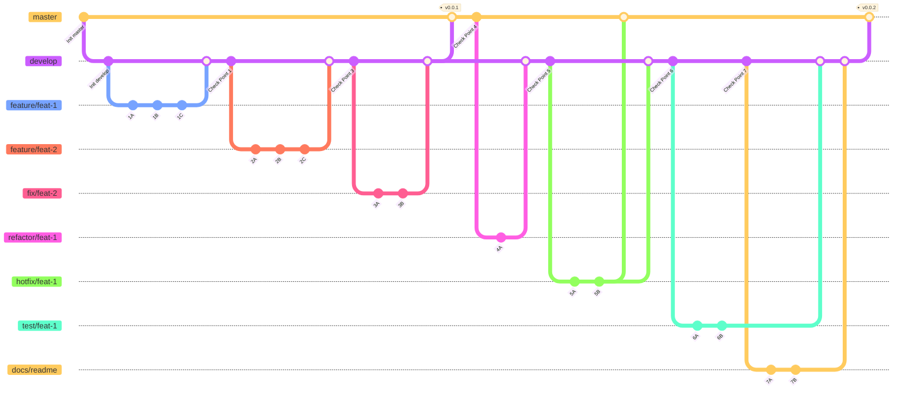

##### Contributor向けドキュメント

# ブランチルール 🌱



## 原則

マージ時には例外以外ローカルでマージするのではなく、リモートでPull Requetsを通してマージしてください。

例外には`hotfix`ブランチから`develop`ブランチにマージする場合です。  
これが可能になる場面は、`hotfix`ブランチから`master`にPull Requestsを通したマージ後、マージした担当者が`hotfix`ブランチを`develop`ブランチにマージしてください。  
コンフリクトが発生した場合はその機能を作成した貢献者と`Pull Requests`作成者と協力してコンフリクトを解消してください。

`git merge`コマンドを使ってマージは行わないでください。  
また、`develop`ブランチにPull Requestsを通して、作成したブランチをマージした場合、GitHub Actionsが自動でリモートのブランチを削除します。  
リモートでマージ済みのブランチをローカルで削除するかは委任します。

## ブランチ一覧

### master

原則として`master`ブランチに直接コミットしないでください。

このブランチは`develop`及び`hotfix`ブランチからPull Requestsを通してマージされます。  
なお、このブランチは必ず動作するコードがコミットされます。  
デバッグ中のコード及び動作しないコードなどを含むブランチをマージしないでください。
また、`master`ブランチにマージする権限を持つものはリポジトリオーナーのみ可能です。

### develop

原則として`develop`ブランチに直接コミットしないでください。

このブランチは以下の方法で作成可能です。

```bash
git checkout -b develop master
```

作成後リモートにプッシュしてください。

```bash
git push --set-upstream origin develop
```

このブランチは`feature`及び`fix`及び`test`及び`docs`及び`refactor`ブランチからPull Requestsを通してマージされます。  
このブランチには追加及び変更した機能が動作する状態かつメジャーリリースすると決断した上でマージしてください。

### hotfix

原則として`hotfix`ブランチの命名規則は`hotfix/機能名`です。機能名は英語で記載してください。

`hotfix`ブランチは`master`ブランチにてすでに提供されているコードに早急に直すべきバグ及び脆弱性などが見つかった場合に作成及び使用するブランチです。

このブランチは以下の方法で作成可能です。

```bash
git checkout -b hotfix/feat-name master
```

作成後リモートにプッシュしてください。

```bash
git push --set-upstream origin hotfix/feat-name
```

このブランチでは自由作業及び未完成のコードをコミットしても構いません。

ただし、`master`にマージする場合にはコード完成後Pull Requestsを通してマージしてください。

### feature

原則として`feature`ブランチの命名規則は`feature/機能名`です。機能名は英語で記載してください。

`feature`ブランチは新機能を作成する場合に作成及び使用するブランチです。

このブランチは以下の方法で作成可能です。

```bash
git checkout -b feature/feat-name develop
```

作成後リモートにプッシュしてください。

```bash
git push --set-upstream origin feature/feat-name
```

このブランチでは自由作業及び未完成のコードをコミットしても構いません。

ただし、`develop`にマージする場合にはコード完成後Pull Requestsを通してマージしてください。

### fix

原則として`fix`ブランチの命名規則は`fix/機能名`です。機能名は英語で記載してください。

`fix`ブランチはバグや脆弱性などを修正する場合に作成及び使用するブランチです。

このブランチは以下の方法で作成可能です。

```bash
git checkout -b fix/feat-name develop
```

作成後リモートにプッシュしてください。

```bash
git push --set-upstream origin fix/feat-name
```

このブランチでは自由作業及び未完成のコードをコミットしても構いません。

ただし、`develop`にマージする場合にはコード完成後Pull Requestsを通してマージしてください。

### test

原則として`test`ブランチの命名規則は`test/機能名`です。機能名は英語で記載してください。

`test`ブランチは機能をテストする場合に作成及び使用するブランチです。

このブランチは以下の方法で作成可能です。

```bash
git checkout -b test/feat-name develop
```

作成後リモートにプッシュしてください。

```bash
git push --set-upstream origin test/feat-name
```

このブランチでは自由作業及び未完成のコードをコミットしても構いません。

ただし、`develop`にマージする場合にはコード完成後Pull Requestsを通してマージしてください。

### docs

原則として`docs`ブランチの命名規則は`docs/内容`です。内容名は内容を一言に要約したものを英語で記載してください。

`docs`ブランチはドキュメントを編集及び追加する場合に作成及び使用するブランチです。

このブランチは以下の方法で作成可能です。

```bash
git checkout -b docs/feat-name develop
```

作成後リモートにプッシュしてください。

```bash
git push --set-upstream origin docs/feat-name
```

このブランチでは自由作業及び未完成のコードをコミットしても構いません。

ただし、`develop`にマージする場合にはコード完成後Pull Requestsを通してマージしてください。
