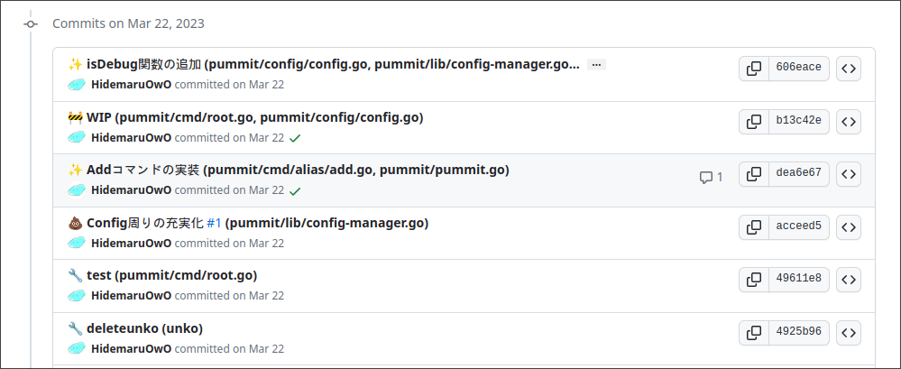

##### Contributor向けドキュメント

# コミットメッセージのルールについて

## 前提

本プロジェクトでは管理の効率化のためコミットメッセージにフォーマットをを定めてます。

- [参考](https://qiita.com/Jung0/items/0a9a7a97a2c17f92d3c5)

## フォーマット

フォーマットについては以下のとおりです。

```
# ==================== Format ====================
# :emoji: Subject (Dir/AddedFile Dir/AddedFile)
#
# Commit body...
```

### 絵文字

フォーマットには`:emoji:`という項目があります。
この絵文字はただの絵文字でもいいですが、絵文字プレフィックスを使うと楽です。
(ただし、Pummitを使用すると、自動で絵文字に変換されます。変換されたくない場合は`.config/pummit/config.json`の`"writeEmoji"`を`false`に変更してください。)
[絵文字プレフィックス一覧](https://gist.github.com/rxaviers/7360908)をご覧ください。

このプロジェクトでは使う絵文字は以下のとおりです。

```
# ==================== Emojis ====================
# 🎉  :tada: 初めてのコミット（Initial Commit）
# ♻️   :recycle: マージ(Merge)
# 🔖  :bookmark: バージョンタグ（Version Tag）
# ✨  :sparkles: 新機能（New Feature）
# 🐛  :bug: バグ修正（Bagfix）
# 👀  :eyes: リファクタリング(Refactoring)
# 📚  :books: ドキュメント（Documentation）
# 🎨  :art: デザインUI/UX(Accessibility)
# 🐎  :horse: パフォーマンス（Performance）
# 🔧  :wrench: ツール（Tooling）
# 🚨  :rotating_light: テスト（Tests）
# 💩  :hankey: 非推奨追加（Deprecation）
# 🗑️  :wastebasket: 削除（Removal）
# 🚧  :construction: WIP(Work In Progress)
# ☃️  :snowman: 仕様変更

# ==================== Format ====================
# :emoji: Subject (Dir/AddedFile Dir/AddedFile)
#
# Commit body...
```

## コミットの効率化

このフォーマットでコミットするのに最適な[pummit](https://github.com/HidemaruOwO/pummit)というツールがあります。
このツールを使用すると、このフォーマットに従ったコミットを円滑に作成可能です。



<div align="center">

[](https://github.com/HidemaruOwO/pummit)

</div>

使用方法についてはpummitのREADMEをご覧ください。

https://github.com/HidemaruOwO/pummit
